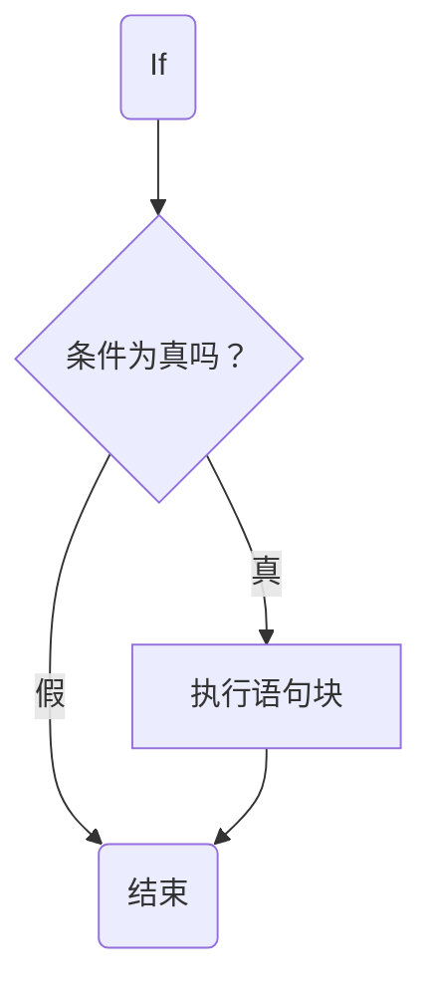
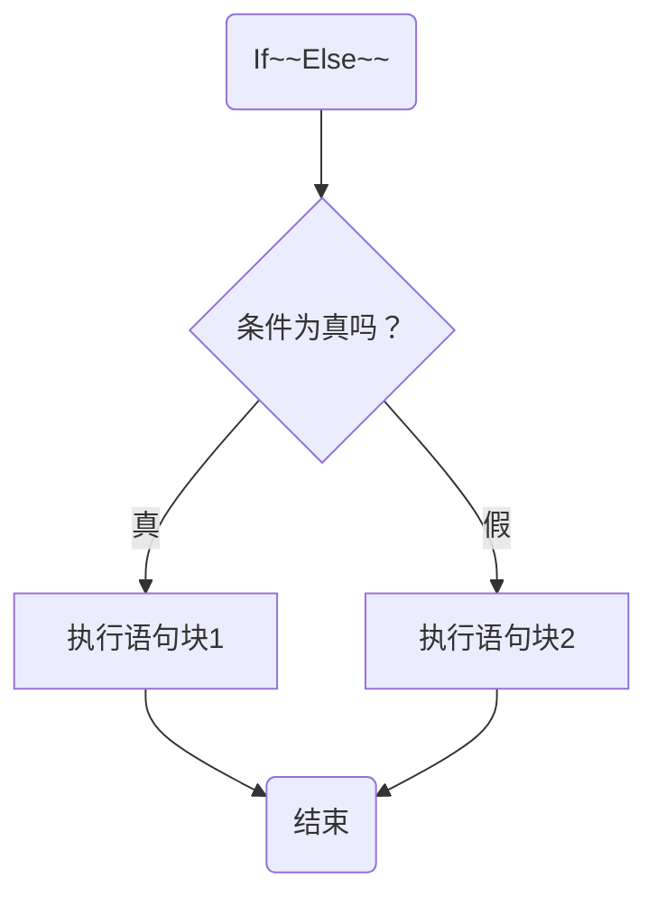
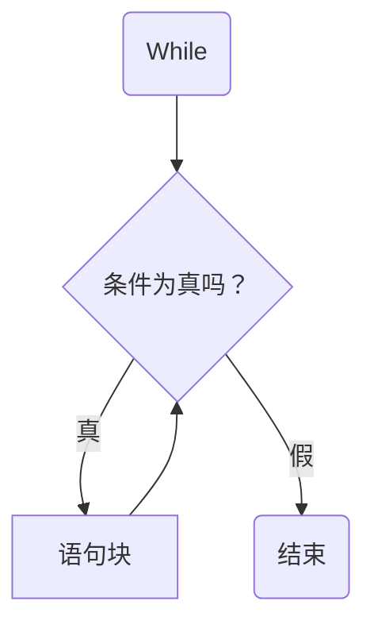

# Python基本入门

> 本文章是对陈宝峰老师的视频笔记以及加入个人直观的理解，原视频请见[跟峰哥学编程](https://space.bilibili.com/3461574561892826/channel/collectiondetail?sid=865380)，请陈老师谅解，侵权请联系删除

# 第一章：基本概念

## 一：安装 
  1. 从官网[Python](www.python.org)下载最新版本的安装包  
  2. Windows下记得勾选‘添加到环境变量’，方便启动，可在win+r输入cmd输入python便可打开
  3. 为方便日后管理，建议自定义安装路径
  4. pip是python的第三方库，可以下载一些方便编写的工具，cmd输入python -m pip --version 或 pip list查看是否显示版本号
  5. 一个好的IDE也能帮助你，比如VSCode（虽然默认的IDLE也能用），将软件关联到python
## 二：基本语法
### 1. 空格与缩进
> python与其它语言的花括号不同，需要用***空格与缩进***来组织代码结构（类似段落）  

> print函数
```python
if 1 > 2:
    print('Yes!')
```
* 所以也要注意何时空格，何时缩进
* 风格统一，可读性强
* 从现在开始，也要注意python的编写格式了，尽量简洁美观大方  
### 2. 注释

* 在你的程序里面进行解释说明，方便他人阅读
* 鼓励少写注释，将代码本身就写的像注释一样

```python
# 这是单行注释,a是举例
a = 1    # 注意井号后可加空格

a = 2   # 这是行内注释,a是举例

#灵活运用两者，一为长部分注释，一为简单单行注释
#不支持嵌套，多行注释（以后会讲）
```  
### 3. 语句跨行
> 使用反斜杠 \ 来进行跨行
```python
a = 1 + \
2           #可以通过反斜杠\来续行，避免语句过长

print(a)    #!注意\后不能有任何东西，空格也不行(建议把\本身当作下一行的空格，也没必要在它前面空格)
```  
### 4. 标识符
* Python ***对各种 变量、方法、函数等命名时使用的字符序列称为标识符***
* 也可以说凡是自己可以起名字的地方都叫标识符
* 标识符就是一个名字，它的主要作用就是作为变量、函数、类、模块以及其他对象的名称
* 规则：***字母或下划线开头，后可接字母数字下划线（不可用特殊字符，大小写区分）***
* 规则：***不能是python系统保留的关键字***
  
### 5. 关键字
> 一共25个，边学边记
* and	逻辑与
* or	逻辑或
* not	逻辑非
* if	条件语句，常与else、elif结合使用
* elif	条件语句，常与if、else结合使用
* else	在条件语句中使用，与if、elif结合使用。也可用于异常和循环语句
* for	for循环语句
* while	while循环语句
* True	布尔类型的值,表示真,与False相反
* False	布尔类型的值,表示假,与True相反
* continue	跳出本次循环，断续执行下一次循环
* break	中断整个循环语句的执行
* pass	空的类、方法或函数的占位符
* try	常用于捕捉异常，与except、finally 结合使用
* except	except 包含捕获异常后的操作代码块，与try、finally 结合使用
* finally	出现异常后，始终要执行finally 包含的代码块，与try、except 结合使用。
* raise	抛出异常
* from	用于导入模块，与import 结合使用
* import	用于导入模块,与from结合使用
* def	定义函数或方法
* return	函数或方法的返回值
* class	定义一个类
* lambda	匿名函数
* del	删除变量或某个序列中的值
* global	定义一个全局变量
* nonlocal	声明一个非局部变量，用于标识外部作用域的变量
* in	判断某个变量是否在序列中
* is	判断是否是同一个对象
* None	表示什么也没有，它有自己的数据类型- NoneType
* assert	用于调试
* as	创建别名
* with	常和open使用，用于读取或写入文件
* yield	结束一个函数，返回一个生成器，用于从函数依次返回值
### 6. 字符串
> python中的字符串定义有：
* 单引号'  
* 双引号"  
* 三个单引号‘’‘  
* 三个双引号“”“  
> 每个字符串只能用一种，注意中英文切换  

> 在语句跨行时，可以***用三引号来进行连接***，***注意与上文中\的区别***
```python
msg_a = 'This is a example' \
    'this is a example'            
    #>>>This is a examplethis is a example
    #二者直接连接
msg_b = '''
    This is a example
    this is a example
    '''                            
    #>>>    This is a example
    #this is a example
    #会包含空格，换行等等
    #(>>>是python默认的命令行状态，边写边执行)
```
## 三：变量
> python变量是用于存储数据的标识符，变量中值可以随着程序发生改变

### 1. 创建一个变量
```python
a = 1   
``` 
  - 变量不需要指定类型，而是在赋值时由值的类型定义
  - 变量在***初始赋值以后仍然可以改变类型***，这一点比较独特
  - 但是完全不建议这么干，与其它语言一样，在定义变量时是从内存里划出来一块，当你改变类型时，会被指向一块新的内存，原来的还会在

### 2. 变量的赋值
```python
age = 12
```
  - 用“空格等于空格”来将变量右侧的值赋给左侧的变量，变量名 = 值
  - 变量可以字母或下划线开头
  - 后可接字母数字下划线
  - 不包含空格

### 3. 变量的命名
```python
sale_price = 30  

  #建议小写，多词语用下划线连接
  #比如上文a就不合适，而age便能让读者理解

print(age)    #函数print，用于将括号内的数据打印出来
```
### 4. 变量的运行逻辑
```python
age = 24 #数值可以改变，原来的便消失了
print(age)    #整个程序由上往下运行，会先打印12再24 

name = 'Tom'  #age和name是两个不同类型的变量（整数和字符串）

name = 23     #虽说一个变量的类型可以变化，但会消耗内存占用，所以不建议如此
```
### 5. 常量
* python中没有对常量有特殊命名方式，只需***全大写字母作为名字***即可定义一个常量
```python
PI = 3.14

E = 2.71828

STR_NAME = "AJSHDKAHSDKJHAKSJDHAKHDJS"
```
## 四：String
### 1.定义与命名
* String就是在引号间的字符序列(单双皆可)
```python
message = 'This is a string'
message = "That is a string"
message = 'This is "a" string'
  
  #可以用两种字符来分别表示，中间的会作为字符而不是符号
```
### 2. 转义字符
```python
message = 'This is \'Tom\',hi'

print(message)

  #反斜杠\也可用于在字符串中进行转义（只有紧跟在后面的才会）
  #把字符本来的意义进行转变，作为字符串的一部分
  #可以把不可见的字符进行转义

message = 'This \n is \n a \n string'    #\n回车符（光标到下一行开头）
message = 'This \r is \r a \r string'    #\r换行符（光标回到本行开头）
message = 'This \\ is \\ a \\ string'    #\本身也可被转义作为字符
message = 'This \' is \" a string'       #也可以这样打出引号

print(message)
```
### 3. 原生字符串
```python
message = r"this is a / string / "  

  # 可以在字符开头加一个r（raw，原生)，将整个引号内的全部作为字符
  # 注意上面要在\后加一个空格，不然'就被转义了
  # r后面是双引号！！！
```
### 4. 字符串的连接
```python
message = '''
Hi!
My name is ---
Peter
'''
  
  #多行字符串用三引号进行连接，空格换行会保留

greeting = 'Hello'

name = 'Jack'

message = greeting + name + '!'    #注意如果greeting和name末尾不包含空格的话，结果会连起来

  #可以用加号连接字符串

message = '0123456789876543210' \
          '9876543210123456789'    #python会自动连接横着放的字符，比如左侧会变成下面

message = '0123456789876543210' '9876543210123456789'   #而这个会自动连接

message = '01234567898765432109876543210123456789'      #会变成这样
```
### 5. 格式化字符串
```python
name = 'Tom'

message = f'Hello {name} !'
  
  #在字符前加一个f（format，格式)，可将花括号{ }内的内容解释为变量
  #这就方便信息随着变量而变化
```
### 6. lan函数
```python
len(name)

  #函数lan( )，会返回括号内字符串变量的长度

len('Jack')

name_length = len(name)

print(name_length)
  #可以计算单个字符串，也可计算字符变量的长度

word = 'my string'

  #还可以获取一个字符，用中括号扩中的数字代表

print(word[1])
print(word[-1])
print(word[0])

  #注意，数字符时从零开始数
  #第一位为零，负一为倒数第一位
  #比如上文m为0，y为1，空格为2

  #还可以提取字符串中的一部分

print(word[2:5])
print(word[2:])
print(word[:5])

  #从~~到~~，从包含，到不包含
  #2:便为从2打到结尾，:5同理
  #比如上文为' st'，' string'，'my st'
```
## 五：数
### 1. 整数  
* $1，2，3$一类的数，可以通过算数运算符进行加减乘除
* 在cmd中运行会直接返回结果，边写边执行

    >  \>\>\>10 + 20  
    > 30  
    > 要退出python命令行，用***函数exit()***

### 2. 浮点数
* $0.5 - 0.6 \times 0.2$  
    > 就是带小数部分，同样可以加减乘除

* $1 + 2.0 = 3.0$  
    > 浮点数与整数运算仍会保留小数
### 3. 数学运算符  
* 10 + 20
* 2 * 3
* 10 / 5 
    > 结果是2.0，***所有的除法运算结果都是浮点数(小数)***  
* 3 ** 3  
    > 平方用双*号表示
### 4. type函数
```python
result = 5 - 80

type(result)
  
  #type函数，返回括号内物品的类型(比如这里是'int')

msg = type(10 / 3)

print(msg)     #float浮点数


msg = type(message)

print(msg)     #str字符串
```
### 5. 下划线  
```python
result = 1_0000_0000

result = 1_000_000
 
  #为方便阅读，可以在数中用下划线进行分割
```
### 6. 表达式
* 表达式是代码的重要组成部分，一个表达式由***运算符***和***操作数***两部分组成，一个表达式就描述了***对哪些数据，进行了什么样的操作***
```python
sum = 1 + 2 
# 这就是一个表达式，将1与2的和相加，将得到的结果赋给sum这个变量
```
* 请记住这个定义，关于运算符我们到下一章讲解
### 7.科学计数法
* 用e的方式科学计数，方便阅读
```python
num1 = 1.235e+1000
num2 = 5612e-100000
```
* format函数
```python
num1 = float(5800000.00000)
num2 = float(0.0000058)
print(format(num1, ".1E"))
print(format(num2, ".1E"))
```
* fsrting
```python
no1 = float(5800000.00000)
no2 = float(0.0000058)
print(f"{no1:.1E}")
print(f"{no2:.1E}")
```
## 六：布尔量
### 1. 定义
* python中的布尔值有两个：True和False***首字母大写***
```python
example = True  #这是一个布尔变量，类型为<class 'bool'>

print(2 > 4)    #结果为False

print('a' > 'b')   #虽说这不是变量，但从字符上说a的编码小于b，所以为假

  #既可以直接赋值得到，也可以逻辑比较得到
```
### 2. bool函数  
```python
bool('hi')    #bool函数，可以判断括号内的内容真假

example = bool('Hello!')  #对于一个有内容的变量，结果都是真

print(example)

example = bool('')

print(example)
```
* 以下***结果均为假***  
    > 0(数值)  
    > 空字符串''""   ***注意引号内不能有空格***  
    > False  
    > None  
    > 空list[]  
    > 空tuple()  
    > 空dictionary{}  
## 七： 类型转换
### 1. 需求
* 当数据类型不满足需要时，需要进行类型转换(比如需要数字但却是字符)
```python
'12' + '23'  #>>>结果为1223
```
* 如果想得到12与23相加的结果，便要进行类型转换

### 2. input函数与类型转换  
```python
input()   #函数input，可从控制台中获取用户指定的字符

number = input('输入一个整数')    #将用户数据输入一个变量

  #input()得到的是字符串而不是整数
  #如果想要得到input中的数字，就要进行转换

int(number)  #int可将括号内的变量转换为整数类型

  #这里先是转换字符与整数，以后会有很多
  #注意用int转换并不改变变量的类型
  #比如如果number是字符的话，转换完仍为字符
  #要保留转换的结果，请赋值给一个新变量

int('12') + int('25') #>>>结果为37
```
* 还有一些常用转换  
    > int(str)   整数转字符  
    > str(int)   字符转整数，注意只有全数字字符才支持，否则会报错  
    > float(str)  同理  
    > bool(variable)  变量判断布尔    
    > str(variable)  
## 八：操作符
* 操作符可分为运算符（operators）和分隔符（delimiters），先讲运算符  
### 1. 算数运算符
* 其实就是上文的加减乘除乘方
* 有些符号不能连接整数和字符(比如加号)
* 将一个字符串做乘法会多次出现
    - \+ **加号**
    - \- **减号**
    - \* **乘号**
    - \/ **除号**
    -  // **除法向下取整**
    - % **取余**
    - ** **幂**
```python
a = 20
b = 7

a + b = 27
a - b = 13
a * b = 140
a / b = 2.857142857142857
a // b = 2
a % b = 6  # 20除以7余6
a ** b = 1280000000

print('msg' * 5)  #输出msgmsgmsgmsgmsg
```  
### 2. 比较操作符(对数据进行比较的运算符)，结果为True或False
* 小于<
* 小于等于<=
* 大于>
* 大于等于>=
* 等于 ==    (一个等于号用来给变量赋值，两个才是等于)
* 不等于!=
```python
2 < 3           #>>>True

67 == 90        #>>>False

7 != 9          #>>>False
```
### 3. 逻辑操作符(对布尔值进行运算)
* 并且(and)
* 或者(or)
* 非(not)
```python
bool_var_a = bool(age)  #>>>True

bool_var_b = bool(0)    #>>>False

bool_var_a and bool_var_b    #二者皆为真，结果才为True，一个为假结果就是假

  #输出为False

bool_var_a or bool_var_b     #二者任一为真，结果就为真

  #输出为True

not bool_var_a               #对单个数据进行反转，真为假，假为真

  #输出为False

number = 52
number > 50 and number <= 70

  #可以利用逻辑运算符限定条件
  #当number同时大于50小于等于70才为真
```
### 4. 赋值运算符
* ***等号 = 是最基本的赋值运算符***，= 右边的值称为右值，= 左边的值称为左值
* 赋值运算符 = 的含义是将***右值赋值给左值***
```python
a = b
# a 为左值，b 为右值，这行代码的含义是，将b 的值赋值给a
```
* 下面这些赋值运算符，都是在赋值运算符 = 与算术运算符的基础上衍生出来的，是一种简写形式
  - \+=  $~~$ a += b 相当于 a = a + b
  - \-=  $~~~$ a -= b 相当于 a = a - b
  - \*=  $~~~$ a *= b 相当于 a = a * b
  - \/= $~~~$ a /= b 相当于 a = a / b
  - \//= $~~$ a //= b相当于 a = a // b
  - \%= $~~~$ a %= b 相当于 a = a % b
  - \**= $~~~$ a **= b 相当于 a = a ** b
### 5. 表达式的优先级
* ***运算符有优先级之分，表达式在计算的时候，会先计算优先级较高的，处于同一优先级时，会从左到右计算***
* 小括号()的优先级高于所有运算符的优先级，如果想改变计算顺序，可以使用小括号()

# 第二章：语句

## 九：条件语句
### 1. if 语句
* 语法结构
```python
if 条件表达式：    
    语句块
```
```python
if age > 20:             #判断条件是否为真
    print('你长大了')     #真，执行结果

  #注意，语句块前有4个空格或一个Tab以保证属于if
  #注意，if条件后面有空格
```
* if 语句执行流程  

* 示例
```python
if int(number) > 0:                   #设定条件与结果
    print('这是一个正整数')       

print('这是一个负整数')           #这个命令无论上面真假与否都会执行，因为没有空格关联到条件语句
```
### 2. if\~~else~~语句
* 语法结构
```python
if 条件表达式：      
    语句块1  
else:  
    语句块2
```    
* if\~~else~~ 语句执行流程
```

* 示例  
> input函数
```python
number = input('输入一个整数')    

if int(number) > 0:               #注意input得到的是字符串而不是整数   
    print('这是一个正整数')       
else:
    print('I\'m sorry')  #转义符活学活用
```
### 3.if\~~elif\~~else~~语句
* 语法结构 
```python
 if 条件1：      
    语句块1  
 elif 条件2：  
    语句块2  
 \~~~  
 else:  
    语句块n
```
* 示例
```python
number = input('输入一个整数')    

if int(number) > 0:
    print('这是正数')
elif int(number) == 0:           #可以加无数个
    print('这是0')
else:                            #其他这里不用打条件了
    print('这是负数')
```
### 4. 三元运算符
* 语法结构
```python
值1 if 条件表达式 else 值2
```
* 示例  
```python
n = 56
35 if n > 0 else 34  #如果条件为真，这个表达式为值1，假则返回值2

color = 'RED' if int(number) > 50 else 'BLUE'  #如果number大于50为红色，小于为蓝色

print(color)
```
### 5.条件语句小练习
* 要求：用户输入一个数字，打印出成绩的优良度

*示例
```python
tip = '请输入你的成绩: '       #第一步，提前设定好input时的提示信息，不用多次输入
  #空格划分部分
grade = input(tip)            #将用户输入的字符输入变量
int_grade = int(grade)        #将字符转换为整数，输入新变量防止以后多次转换类型
                              #也可以每个地方都敲一遍，但未来如果变量一改还是不如如此
if int_grade < 0 or int_grade > 100:   #可以先划定一个最大的范围
    print('你在玩我！')                 
elif int_grade < 60:                   #由于输入这步的已经都是0~~100的数了
    print('不及格')                     #相比int_grade >= 0 and int_grade < 60: ，节省了笔墨
elif int_grade < 75:                   #同理，这一步已经筛选到了75~~100的数
    print('及格')
elif int_grade < 90:
    print('良')
else:
    print('优')                        #不需要再写elif了，其他条件只有优了
```
* 小结： 
    > 习惯将多次利用的数据定义为变量，少写些  
    > 检查类型是否需要转换   
    > if\~~elif~~else语句  
    > 建立层层筛选的条件，少写些  
## 十： for 循环语句
### 1. range函数
* 像print()一样，它也是一个内建函数，拿来即用
```python 
n = 10
b = 20

range(n)   #生成0，1，2，3，~~~，n - 1(注意是末尾减一)，步长为1
  #>>>0，1，2，3，4，5，6，7，8

range(a,b)   #生成从a到b-1的连续整数，步长为1
  #>>>1，2，3，4，5，6，7，8，9，10，11，12，13，14，15，16，17，18，19

range(a,b,n) #生成从a到b-1以n为递增值的连续整数
  #>>>1，10    (不会生成20，因为不会等于末尾)
```
### 2. 基于range的for 循环
```python
for 变量 in 循环：
    循环体语句块
```
> 语句格式如下:  
> 通过 for 循环依次将'循环序列'(range(S))中的数据取出赋值给'变量'(index)，再通过'循环体'(print)进行处理
```python
for index in range(1,20):   #>>>1，2，3，4，5，6，7，8，9，10，11，12，13，14，15，16，17，18，19   
    print(index)
    #在函数range中进行循环，每循环一次将range的值赋给index，再执行一遍命令
    #for会依次选择数值
```
### 3. for循环语句小练习
  > 要求：
  > 输入两个数，计算从第一个数到第二个数的累加结果
```python
tip = '输入数字： \n'                       #用换行符美观输入界面
sum_num1 = input(tip + '1: ')              #由于要求输入两个整数，定义两个变量
sum_num2 = input(tip + '2: ')
  
  #在这里不二次输入提示，而是在输入重复部分后在用加号添加不同片段，也是省事的小技巧
  #注意在不同部分间空格方便读者理解

start_num = int(sum_num1)                  #将输入的字符转换为整数
stop_num = int(sum_num2) + 1               #注意，先提前知晓range函数结尾是n-1，所以提前+1弥补
  
  #在对变量进行命名时，坐到‘简短，易理解，格式化’

  #在观看下一部分时，请先好好的滤清思路
  #我们要求和，那么为了获得序列中的所有数字，要使用range函数，输入的两个数字为起始
  #由于要一直循环求和，要使用for语句
  #编程重要思想，分布思考：
  #1>>>循环第一遍，将range第一个输出的值(用户第一个输入的)返回到for中的变量，需要某种方式保存此变量
  #2>>>循环第二遍，将第二个输出的值与保存的变量相加，并仍将此定义为该变量
  #3>>>循环第三遍，将第三个输出的值与保存的变量相加，并仍将此定义为~~~
  #~~~
  #n>>>循环第n遍，将第n个输出的值(用户第二个输入的+1)与保存的变量相加，循环结束，打印此变量

  #可以看到大部分都是重复的，可以用‘变量 = 变量 + for中的变量’来放置在for的下方
  #为了让第一步的值也加入，不妨让变量一开始便等于0，这样与想法一致

  #详解变量更改的优先
  #由于这里我们要设定一个可以被更改的变量，那么它该放在哪里？
    
    #法1：
for num in range(1,10):       #逻辑：
    sum = 0                   #每遍循环，都认为sum=0，用range给出到num的值加0
    sum = sum + num           #所以sum每遍都会被重置，最后只能是最大的9
    
    #>>>9

    #法2：
sum = 0                       #逻辑：
for num in range(1,10):       #每遍循环，将range给出到num的新值输入到上一次循环的sum
    sum = sum + num           #所以结果为range所有结果的累加
                              
    #>>>45
    
    #法3：
for num in range(1,10):       #逻辑：
    sum = sum + num           #每遍循环，找不到sum值的定义
sum = 0                       #报错
  
    #>>>TypeError
  
  #很明显，法2为所需
  #怎么理解？当你定义一个变量时，它被写入到了内存中，程序运行从上往下，对于在下方的定义，由于不在内存，命令并不知道它是谁
  #变量的定义位置(比如sum = 0)，并不意味它只能被这种什么等于什么的方式去更改
  #比如sum = 0，第一次循环时，sum = 1，虽然它的定义没有被更改(sum = 0还在)，但是内存中它已经被更改且保存了
  #当下一次在调用时，调用的时内存中的sum = 1，而不是sum = 0
  #所以为什么上文中说'变量是可更改的'
  #理解了吗？

  #结果便是如下，sum直接是结果了所以改成result了
result = 0
for num in range(start_num,stop_num):
    result = num + result

print(f'累积和为:{result}')  #活学活用，用一个f省了很多类型转换

print('累积和为:' + sum)     #这样是TypeError，加号不能将字符和数字自动连接
```
### 4. 小结：
    > 1：对于大量重复字符，输入重复部分后用加号添加不同对象
    > 2：在输入range前牢记含首不含尾
    > 3：简短，易理解，格式化的变量命名
    > 4：在不同部分间空格方便读者理解
    > 5：分布思考的思想
    > 6：多尝试，得出满意的结果
    > 7：活学活用，减轻操作
    > 8：记住num = num + 1格式
## 十一： while 循环语句
### 1. 语法结构
```python
 while 条件语句:  
    循环体语句块
```
### 2. 流程图

### 3. 示例  
```python
number = 1                          #限制条件
while number < 5:                   #判断条件
    number = number + 1             #限制条件
    print(number)                   #真正执行内容

  #随着程序运行，条件值若含有变量的话，条件值可能运行一段后结束
  #如果条件一直为真(没有限制条件)，while会一直运行下去，这叫死循环
  #比如这样(while:)就是死循环

  #对比同一条命令，for和while的不同写法
for index in range(1,11):
    print(index)

num = 1
while num != 11:              #刚开始num从1打印同时加1开始循环，当num等于11时，程序停止运行
    print(num)                #调换print和限制条件的顺序会有影响
    num = num + 1
``` 
* 当***知晓循环次数时，使用for较好，反之亦然***，但并不代表强制，按需所求
* 又是当我们刻意要求死循环时，也会使用不含限制的while

### 4. while循环语句小练习
    >要求：  
    >用户输入数个数值，返回成绩的优良度，当输入exit退出时，返回数值的平均值  
    >可能有点难，咱们一步一步来
```python
1：如果毫无头绪的话，可以先写出提示

tip = '输入一个1~~~100的数(输入exit退出)'

  #2：无论如何，都需要一个变量载入input，input中有tip

num = input(tip)

  #3：由于要连续载入数字，并且我们不知道次数，猜测应该会用上while

while example:
    example

    #但这里我们并不知道要有什么限制条件以及要执行什么，可以暂时先不写
    #也可以在此处打上注释，写完其他部分再回头
  
  #4：在连续执行的部分中，一定有一部分是要判断用户的成绩，如果while停止了，这段也会停止，所以可在while内输入一段利用if判断的部分

while example:
    example
    num = input(tip)                     #由于这句话每次都要出现，所以加入循环
    int_grade = int(num)                 #知道比较的数值要进行转换
    if int_grade < 0 or int_grade > 100:   
        print('你在玩我！')                 #使用ctrl+[]快速将代码块前后缩进
    elif int_grade < 60:                 #使用ctrl+上下左右快速移动
        print('不及格')                     #使用shift+上下左右快速选择
    elif int_grade < 75:                   
        print('及格')
    elif int_grade < 90:
        print('良')
    else:
        print('优') 
    
    #虽然我们并不清楚要干什么，但可以先写上
  
  #5：现在我们来看看还少点什么，没错，如果用户输入的是exit怎么办？这里有两种做法
    #法1：
      #在while后面输入>>>num != 'exit'
      #如果用户输入的是exit，值为False，while里的什么都不会执行
      #如果用户输入的不是exit，值为True，则会执行while里的命令

while num != 'exit':
    num = input(tip)
    int_grade = int(num)                 #在这里我们已经保证了num是整数，所以转换不会出问题
    if int_grade < 0 or int_grade > 100:   
        print('你在玩我！')                 
    elif int_grade < 60:                 
        print('不及格')                     
    elif int_grade < 75:                   
        print('及格')
    elif int_grade < 90:
        print('良')
    else:
        print('优')
    
    #法2：
      #我们知道要存在一个判断程序，提前(指在进行类型转换之前以免报错)进行判断num是否为exit

while example:
    num = input(tip)
    
    if num == 'exit':
        example
    else:
        int_grade = int(num)        #将转换类型移动到这里，只有在num不是exit时才执行         
        if int_grade < 0 or int_grade > 100:   
            print('你在玩我！')                 
        elif int_grade < 60:                 
            print('不及格')                     
        elif int_grade < 75:                   
            print('及格')
        elif int_grade < 90:
            print('良')
        else:
            print('优')
      
      #如果num不是exit，我们执行else里的
      #如果是，我们需要返回一个变量以限制while进行运行

running = True
while running:
    num = input(tip)
    
    if num == 'exit':
        running = False
    else: 
        int_grade = int(num)                
        if int_grade < 0 or int_grade > 100:   
            print('你在玩我！')                 
        elif int_grade < 60:                 
            print('不及格')                     
        elif int_grade < 75:                   
            print('及格')
        elif int_grade < 90:
            print('良')
        else:
            print('优')
      
      #设定一个running变量，设定在while之前，会一直进行循环
      #在if下(也就是在输入exit)把running改为False，不就再也不会进行循环了吗？
      #当输入一个数字，会一直进行else内的进行循环
      #当输入exit，会进行if，(不访问else下)终止掉循环
  
  #6：好，稍有眉目，这时我们便写出来一个不输入exit会一直判断用户数字的部分，虽说还没完，但可以先运行一下保证局部正确性
    #在写完一个可以自我运行的局部程序时，养成立马运行的习惯，方便排查故障
  
  #7：好，我们还差求平均值这部分没有完成，平均值 = 总和 / 个数，我们可以定义两个变量来实现

summary = 0    #总数等于0
count = 0      #个数也等于0

running = True
while running:
    num = input(tip)
    
    if num == 'exit':
        running = False
    else:  
        int_grade = int(num)              
        if int_grade < 0 or int_grade > 100:   
            print('你在玩我！')                 
        elif int_grade < 60:                 
            print('不及格') 
            summary = summary + int_grade
            count = count + 1                    
        elif int_grade < 75:                   
            print('及格')
            summary = summary + int_grade
            count = count + 1
        elif int_grade < 90:
            print('良')
            summary = summary + int_grade
            count = count + 1
        else:
            print('优')
            summary = summary + int_grade
            count = count + 1
      #以法2举例，可以在每个合法成绩处加1
      #是不是很麻烦，写程序一定要有化繁为简的精神，同一个程序谁的代码少谁赢

running = True
while running:
    num = input(tip)
    
    if num == 'exit':
        running = False
    else: 
        int_grade = int(num)                
        if int_grade < 0 or int_grade > 100:   
            print('你在玩我！') 
        else:
            summary = summary + int_grade        #我们只在除非法成绩(if)外加一个else，表示除非法成绩外统统不计算
            count = count + 1                
            if int_grade < 60:           #加了以后后面的elif就不成立了怎么办，整体再缩进解决     
                print('不及格')                     
            elif int_grade < 75:         #注意左侧的四种非法成绩属于加一       
                print('及格')             
            elif int_grade < 90:         #也就是说本来应该属于每一个合法成绩的加一，由于加一重复，与属于加一的每个合法成绩并无区别
                print('良')
            else:                        #对于这种类型，大可不考虑先后
                print('优')

      #再输一次法1举例

while num != 'exit':
    num = input(tip)                
    if int_grade < 0 or int_grade > 100:   
        print('你在玩我！')                 
    else:
        int_grade = int(num)
        summary = summary + int_grade        
        count = count + 1                
        if int_grade < 60:              
            print('不及格')                     
        elif int_grade < 75:               
            print('及格')             
        elif int_grade < 90:         
            print('良')
        else:                        
            print('优')
    
      #但法1是错误的，因为在num等于exit时还会进行一遍比较导致报错

while num != 'exit':
    num = input(tip)                
    if num == 'exit':
        pass
    else:
        int_grade = int(num)
        if int_grade < 0 or int_grade > 100:   
            print('你在玩我！')                 
        else:
            summary = summary + int_grade        
            count = count + 1                
            if int_grade < 60:              
                print('不及格')                     
            elif int_grade < 75:               
                print('及格')             
            elif int_grade < 90:         
                print('良')
            else:                        
                print('优')
        
        #这样修改即可，pass意为不执行任何操作

  #8：接下来算平均数即可，注意这时已不属于while

average = summary / count
print(f'平均数为:{average}')
  
  #9：结果

tip = '输入一个1~~~100的数(输入exit退出)'             #存放提示
summary = 0                                         #存放总数，初始为0
count = 0                                           #存放次数，初始为0

running = True                    #限制条件
while running:                    #开始循环
    num = input(tip)              #从用户得到一个数字
    
    if num == 'exit':             #如果输入exit，则退出程序
        running = False           #改变限制条件
    else:                         #输入其他
        int_grade = int(num)                        #转换整数        
        if int_grade < 0 or int_grade > 100:        #检测非法成绩
            print('你在玩我！') 
        else:                                       #对于合法成绩
            summary = summary + int_grade           #计分
            count = count + 1                       #计次
            if int_grade < 60:                         #再检测对应成绩打印优良等级
                print('不及格')                     
            elif int_grade < 75:              
                print('及格')             
            elif int_grade < 90:         
                print('良')
            else:                        
                print('优')

average = summary / count         #程序结束后计算平均数
print(f'平均数为:{average}')

#或者

tip = '输入一个1~~~100的数(输入exit退出)'
summary = 0    
count = 0 

while num != 'exit':         #检测上一次的用户输入
    num = input(tip)         #用户输入       
    if num == 'exit':        #如果为exit，结束，下一次while直接关闭
        pass
    else:                    #如果非exit
        int_grade = int(num)                         #整数转换
        if int_grade < 0 or int_grade > 100:         #检测非法成绩
            print('你在玩我！')                 
        else:
            summary = summary + int_grade            #合法成绩计分计次
            count = count + 1                
            if int_grade < 60:              
                print('不及格')                     
            elif int_grade < 75:               
                print('及格')             
            elif int_grade < 90:         
                print('良')
            else:                        
                print('优')

average = summary / count
print(f'平均数为:{average}')
```  
### 5. 小结：
    > 1：对于没有思路的程序可以先写出已知的  
    > 2：学会整理思路，整理代码  
    > 3：懂得试运行  
    > 4：明白如何排除问题  
    > 5：掌握多层if嵌套技巧  
    > 6：换位思考，巧妙转化  
  
* 扩展：
    > 1：如果用户不老实，输入其他怎么办？程序不会处理  
    > 2：用户一上来就输exit怎么办？0 / 0？  
    > 3：可以自己修补以上漏洞  
## 十二：几个特殊关键字
### 1. break 用于中断当前循环  

*  结构:
```python
#while 条件语句：
#    if 条件语句：
#        break        当运行到break时程序就结束了
#    循环体语句块

#for 变量 in 集合：
#    if 条件语句：
#        break
#    循环体语句块
```  
* 举例：
```python
for index in range(1,11):         #变量index为1至10
    if index == 5:                #当index等于5时，这个循环后面的语句会直接结束，不会执行
        break                     #不仅结束子级，也会结束母级的循环，所以只会打印4次
    
    print(index)                  #这个循环用来打印index的值

print('End')                      #独立的一句话用来标志结束
```
* 虽说能简化代码，但是也会令人混淆
### 2. continue 用于跳过当前循环
* 举例
```python
for index in range(1,11):         
    if index == 5:               
        continue                #当执行continue时，会放弃当下直接执行下一次
  
    print(index)                #结果为1，2，3，4，6，7，8，9

print('End')  
```
### 3. pass 什么都不干(占位)
* 示例
```python
height = 196

if height >= 185:
    print('You are tall')
else:
    pass
```
* 有些地方暂时没有写，可以先写上pass再加上注释占位
* 还有些地方如果什么都不写直接接上下一段编译会出错，加上pass结束该段落

# 第三章：函数

## 十三：基本函数
### 1.为什么需要函数？
* 写代码时会有很多部分相似，甚至相同，为了不将代码重复写的一遍又一遍，把一些通用的，重复的模块化起来，函数出现了  
* 便于代码复用  
* 易于阅读，简单的代码越难写，不同的代码块只执行简单的任务，多个组合起来通读顺畅   
* 易于维护，修改时只修改一部分就行  
* 易于测试
### 2. 函数的定义
* 语法：
```python
def 函数名(函数的参数):
    函数体
```
```python
def print_grade_level(grade:int):                 #def关键字，表示我后面要定义一个函数
    if int_grade < 0 or int_grade > 100:          #函数名要起一个有意义通读的名字
        print('你在玩我')                         
    elif int_grade < 60:                          #一对小括号里是函数的参数定义
        print('不及格')
    elif int_grade < 70:                          #函数体就是把一堆语句打包起来
        print('差')
    elif int_grade < 80:                          #底下就是if语句
        print('中')
    elif int_grade < 90:
        print('良')
    else:
        print('优')

#括号也可以不写，写上表示grade这个参数的类型是int
#加上可以让阅读者明白要传给它一个什么值
#所谓参数就是函数使用者未来要传递进来的值，是一个定义，一个信息的描述
#将来调用时要传进来一个值，至于现在里面是什么不用管，只要定义类型
#这种函数里面是一个逻辑，基于参数

def greeting():            #这里定义了一个函数
    print('Hello')

#这种函数无需传递参数，只用来执行
```
 
 ### 3. 函数的调用
```python
greeting()                 #这里就按照调用其他函数的操作一样，打出名字加上括号即可，就会打印出Hello
greeting()                 #可以再打一遍

print_grade_level(56)      #因为这个函数有参数，调用的时候要赋一个值进去
print_grade_level(90)      #不同的值输进去按照相同的运行流程可以得到不同的运行结果
```
> 形参和实参
* ***形参是值函数定义中描述的参数***，比如上面的grade:int，他只是一个形式，不是实体
* ***实参是函数调用时实际传入的参数***
### 4. 函数的返回值
* ***函数可以定义返回值***，返回值是函数调用结束后返回给你的结果
* 函数体内不输出任何结果，而是***把函数本身就当做一种结果***，输出这种结果的方式就可以理解为返回函数的结果，python用return关键词来返回
```python
def get_grade_level(grade:int):
    if grade < 0 or grade > 100:
        return 'invaild number'               #return加空格加返回结果
    elif grade < 80:
        return 'Good'
    else:
        return 'Excellent'
```
* 返回值是暂把信息存到后台
* ***有返回值的函数可以用变量接走***，调用时可以直接print函数名
* ***return后面的所有语句都不会再执行了***，直接结束这个函数
```python
print(get_grade_level(90))
```
* 这就可以直接打印函数的名字，对比print是函数运行便会执行，这种可以将数据变为变量随意使用
* 第一层为print函数的括号，第二层为子定义函数的
* 调用print函数，传给他另一个自定义函数，调用另一个函数获得等级，在传给他一个数字
```python
def display_grade_level(level:str):
    print(f'Your Grade Level is {level}')
```
* 又定义一个函数专门用来打印
```python
display_grade_level(get_grade_level(85))
```
* 函数套函数
* 如果我想要改掉一句话或加上，只需要该一次函数内的定义即可
```python
def get_grade_level(grade:int) -> str:       #一个小箭头可以表示这个函数最后的输出结果是什么，方便阅读
    if grade < 0 or grade > 100:
        return 'invaild number'               
    elif grade < 80:
        return 'Good'
    else:
        return 'Excellent'
```
* 面对多参数的函数，用逗号隔开  
* 调用时也是同理
```python
def summary(a:int,b:int) -> int:
    return a + b

result = summary(5,6)
```

* 可以尝试将以前的作业用函数封装起来
### 5. 函数的缺省参数
* 缺省参数就是指***具备默认值的参数***，在调用函数的时候可以不用给缺省参数传递实参
* 对于有些非必要的参数，方便使用者
* 语法
```python
def function(parameter1,parameter2 = default,parameter3 = 11):
    print(parameter1)
# parameter 形参
# 等于号就是赋缺省值
# 如果使用者调用时没有传值，就使用默认值

# 调用

function(argument1)
function(argument1,argument2)
function(argument1,argument2,argument3)
# argument 实参
# 有缺省值也可以自己传
```
* 举例
```python
def calculate(n:int,p:int = 2):
    return n ** p

print(calculate(2,9))
# 在这里，如果不给p传值，则默认计算平方
# 注意先定义再赋缺省值，顺序不能乱
# 注意传值的顺序，你只能从左至右按照定义时的顺序传，中间用逗号隔开
```
* 所以***有默认值的参数只能在后面***，不然编译器识别不了
* 缺省参数用的地方非常多，有一些参数调用100次中95次都是一个值时就可以用
### 6.  函数的关键字参数
* 关键字参数就是指再***调用函数时通过使用参数名作为关键字进行实参传递***而不需要遵守参数的顺序
* 语法
```python
def function(parameter1,parameter2 = default,parameter3 = 11):
    print(parameter1)

# 调用

function(parameter2=2,parameter3=3,parameter1=1)
# 在所有参数都有默认值时，只想给任意一个参数传值就可以用到
```
* 举例
```python
def function(n1:int = 1,n2:int = 2,n3:int = 3 ):
    print(f'n1:{n1},n2:{n2},n3:{n3}')

function(1)
function(n2=6,n3=3)
```
* 关键字参数是传值时用，缺省参数是定义时用
* 注意***不能关键字参数和默认传值参数混着来***，python解析是按顺序的，满足了顺序参数后再考虑别的，有了可变参数后就不会考虑别的了
* 注意上文在***给参数传值时用的是直接等于，没有空格***，写上空格也可以，但为了和定义时区分开，还是养成好习惯别写
* 请注意，Python***既支持按值传递也支持按引用传递***
> 实际上，解释器会查看对象引用（内存地址）指示的那个值的类型，如果变量指示一个可变的值，就会按引用调用语义。如果所指示的数据的类型是不可变的，则会应用按值调用语义  
```py
列表 字典 集合
# 总是会按引用传入函数，函数代码组中对变量数据结构的任何改变都会反映到调用代码中。

字符串 整数 元组
# 总是会按值传入函数，函数中对变量的任何修改是这个函数私有的，不会反映到调用代码中
```
> 不明白的看HelloC函数篇
### 7. 递归函数
* 递归函数并不是一个专门的的函数，而是指函数的一种应用情况，***指的是一个函数可以调用自己***
* 函数内部可以调用函数，如果他调用的是自己，那他就是递归函数
* 举例
```python
def function():
    print('hi')

    function          # 函数内部有调用自己，再次循环到上面
    
# 这就是递归函数，还是一个死循环，但凡运行电脑就炸了

```
### 8. 递归函数练习
* 练习1：打印1到n的整数
```python
def function(m:int,n:int,title:str):
    if m < 1:
        return(r'dont enter a number that < 1 !!!')
    elif n == m + 1:
        return title
    else:
        n = n + 1
        title = title + ' , ' + str(n)
        function

print(function(m = int(input('please enter a number = ')),n = 1,title = '1'))
```
* 注意上文是完全错误，让我们来看一下错在哪里：
*  没分清return和print的区别，***从定义上来讲，return指的是返回值，print指的是输出，也就是显示出来让你看的东西***
```python
def function(a,b):
    c = a + b
print(function(1,2))

# 这样只会输出一个none，因为函数自带一个输出值none
# print也是一个函数，它调用函数function时，函数并没告诉它要打印什么，于是它打印了none
```
```python
def function(a,b):
    c = a + b
    return c
print(function(1,2))

# 这样print调function，function使用给它的两个实参，计算后返回c，print得到的是c的值，然后打印
```
```python
def function(a,b):
    c = a + b
    print c
function(1,2)

# 这样也能得到结果，因为函数内就包括 '打印' 这一功能，调用它虽然没有返回值，但print会作为运行过程输出
```
```python
def function(a,b):
    c = a + b
    return c
function(1,2)

# 那这个呢，什么都没有，没错，因为你光return了计算结果，但是没有人接，还不是什么都没有干

def function(a,b):
    c = a + b
    return c

f = function(1,2)
print(f)

# 当你用一个变量接走它，就能用了
```
```python
def function(a,b):
    c = a + b
    print(c)
    return c

f = function(1,2)
print(f)

# 这个会有两遍输出，一次是f调用function，执行函数时的过程；另一次是将返回值赋给f后，打印f的结果

def function(a,b):
    c = a + b
    print(c)

f = function(1,2)
print(f)

# 但如果不返回值，那么f本身并没有值，只是有个定义使用了一个函数，所以这次谁输出3和none
```
* 在调用函数时，只要你的函数不是空括号 (无参数) 都要给它传值
* ***尽可能少用print调函数***，如下
```python
# 法1
def function(m:int,n:int,title:str):
    if m < 1:
        return(r'dont enter a number that < 1 !!!')
    elif n == m + 1:
        return title
    else:
        function(m,n=n + 1,title=title + ' , ' + str(n))

print(function(m=int(input('please enter a number = ')),n=1,title= '1'))

# 法2
def function(m:int,n:int,title:str):

    n_next = n + 1
    title = title + ' , ' + str(n_next)

    if m < 1:
        print(r'dont enter a number that < 1 !!!')
    elif n_next == m:
        print(title)
    else:
        function(m,n_next,title)

function(m=int(input('please enter a number = ')),n=0,title=' 0 ')

# 二者没有任何区别，但法1就是none，法2便是我们想要的，原因就在于一个是有返回值让print打印，一个是直接调用直接打印
```
```python
def func(n:int = 10):
    print(n)
    n_next = n - 1 
    if n_next > 0:
        func(n_next)
    else:
        pass

func(int(input'Please enter a num'))

# 这样是轮流打，不是都打到一句话里
```
* ***除非可以用变量接走函数，否则少用return***

* 练习2：数列求和
```python
sum = 0

def func(n:int):
    
    if n == 0:
        return sum
    else:
        sum = sum + n
        n = n - 1
        func(n)

print(func(n=int(input('Please enter a number'))))

# 很简单，但是一运行发现报错
```
* ***python的函数使用内外变量是有限制的***
* 在***函数内可以调用外部的函数***，但是***不可以更改***，如果在函数内部创建一个同名的变量并进行更改，这时python会认为这只是一个***同名的局部变量***，在函数外面调用时还会是原来的值、
* 可以用***关键字global***来声明这是一个全局变量 (以后再讲) 
```python
def summary(n):
    if n <= 1:
        pass
    else:
        return n + summary(n-1)

print(summary(int(input('Please enter a number'))))

# 直接通过一句话便递归起来
# 相较以前那种借用变量暂存的方法，这不是更简单高效吗？
# 但是运行仍会报错，原因是int和nonetype不能想加
# 解决也很简单，if并没有返回值，导致函数没法判断自己是什么类型

def summary(n):
    if n == 1:
        return 1
    elif n < 1:
        return 404
    else:
        return n + summary(n-1)

print(summary(int(input('Please enter a number'))))

# 这就行了
```
* 练习3：n的阶乘
```python
def summary(n):
    if n == 1:
        return 1
    elif n < 1:
        return 404
    else:
        return n * summary(n-1)

print(summary(int(input('Please enter a number'))))

# 这就不用解释了吧，把加号换成乘号
```
* 在上面的例子中，如果用户输入的数字大于1000，程序会报错，原因是
> Python默认递归调用深度为1000（即最多递归调用1000次），而程序在运行过程中超过最大的递归深度

> 为什么最大递归深度要有限制呢？

> 本质上讲，在计算机中，函数调用是通过栈（stack）这种数据结构实现的，每当进入一个函数调用，栈就会加一层栈帧，每当函数返回，栈就会减一层栈帧。由于栈的大小不是无限的，所以，递归调用的次数过多，会导致栈溢出。
在递归调用中，每个函数在调用自己的时候 还没有退出，调用多了肯定会导致内存崩溃，因此需要对递归深度进行限制

> 所以了解递归是一回事，但尽可能少用递归
### 8. lambda表达式
* lambda表达式其实是在***定义一个匿名参数***
* 语法
```python
lambda 参数列表：表达式    # lambda关键字

def anonymous(参数列表):     # anonymous 匿名
    return 表达式

# 上面两个式子返回是一样的 
```
* 我们为什么需要它，请看下面

> 之前说过变量是如何使用内存的，其实变量也是如此  
> 如果把一个***函数的名字赋给一个变量***，函数其实也是一个名字，指向一个内存  
> 用f指向那个函数名，就是让那个***函数拥有了两个名字***，一个是func一个是f  
> 所以用f('Tom')的效果和func('Tom')是一样的  
> 函数也可以赋给变量，可以给一个函数指定好几个名字  
```python
def func(name):
    return f'hi {name}'

f = func     # 函数的名字赋给一个变量
ss = f       # 这样函数就有三个名字了
f('Jack')    # 这样使用和上面是没区别的

print(f('Tom'))
```
* 下文的lambda运行效果和上面的函数效果是一样的，所以λ表达式可以用在一些简短的函数
```python
ff = lambda name: f'hello {name}'  # lambda后面接的是表达式，并不是跟函数一样什么都能接
ff = lambda num: num * 2    
print(ff('Jack'))
```
* ***lambda返回的是一个函数对象***，就是也是有返回值的
```python
a = 'Hello'

print(lambda a:print(a))

# 运行会出现<function <lambda> at 0x0000020DF83A8A40>也是说明这一点
```
* 下面定义了一个lambda函数，并通过***传递字符串作为参数立即调用它***。这就是所谓的***IIFE (immediately invoked function execution): 立即调用函数表达式***
* ***函数一旦被定义，就会被立即执行***
```python
(lambda a:print(a))('Hi')

# 第一个括号是一个立即调用的lambda，第二个括号是传递参数a
# lambda是匿名函数，但加上括号后甚至连变量都不用定义。直接运行
```
* 表达式中出现的参数要在参数列表中定义，且***表达式仅为单行仅能为一个***
* 以下就是一些常见的合法表达式
```python
1
none
c = a + b
f'Hi! {name}'
35 if n > 0 else 34
```
* lambda也不能访问自己参数列表以外的值，仅能完成一些简单的工作
* 所以lambda一般用于***将表达式赋给一个变量***，通过调用变量直接完成lambda函数的工作
```python
add = lambda x,y:x + y   # 定义一个变量指向lambda函数

print(add(5,8))          # 以后直接访问变量即可完成几行函数
```
* 实例1
```python
def get_full_name(first_name:str,last_name:str,formatter):
    print(formatter(first_name,last_name))

first_name_first = lambda first_name,last_name:f'{first_name} {last_name}'
last_name_first = lambda first_name,last_name:f' {last_name} {first_name}'

# 这两段只是举例，并没有用

get_full_name('Tom','Jack',lambda first_name,last_name:f'{first_name} {last_name}')

get_full_name('Tom','Jack',lambda first_name,last_name:f'{last_name} {first_name}')

# 在这里我们制作一个分情况打印名还是姓优先的程序
# 在get_full_name中有三个参数，俩个名字，第三个formatter是一个函数，由于决定名称优先级
# 根据lambda的不同，我们就可以决定名称优先级
# 这里我有些问题，在函数参数内同时定义一个lambda和函数共用的参数，调用时在lambda调用和函数参数同一个名字可以直接读取 /
# 别的情况实在是不行，实在是理解不了了
```
* 实例2
```python
def time(x:int):
    return lambda n: x * n

# 注意，这里返回的是一个lambda函数

double = time(2)

# time(2)的2是x的值
# 但是double实际是lambda n: 2 * n

print(double(3))

# 又给double传一个值，传的是n
# 所以double(3)是2 * 3
# 可能比较绕，多想一想

```

# 第四章：数据结构

## 十四：list列表
### 1.概念与定义
* list是一个***链表数据结构的实现***，可以***存放多个数据在一个list中***，可以增删改，浏览
* 我们为什么需要它？
> 目前我们唯一学过能存放数据的结构叫做变量  
> 那假设让用户输入很多数字，假设1万个，难道我们要手动设1万个变量？  
> 所以需要一个数据结构来***存放未知大小的数据***  
> 随着我们程序的复杂，我们可能需要不同类型的数据结构  
> 其目的一般有二：1.***怎样合理的存放这些数据***；2.***怎样高性能的操作这些数据***  
* ***类和对象***
> 虽然我们现在还没有必要接触这个概念，不过也是时候了  
> 我们常见的编程方法有两种，***面向过程和，面向对象***    
> 面向过程就是很简单。我们将一个程序的运行逻辑变成过程  
> 比如一个下棋程序，分为对黑子移动，判断输赢  
> 白子移动判断输赢  
> 黑子移动判换输赢  
> 对于简单的程序我们可以用简单的面向过程方式简单解决,但是面向复杂的程序我们可以运用叫做面向对象的编程逻辑
> 那什么是面向对象呢？比如上面的下棋  
> 我们可以理解为黑白双方下棋是一个对象，这个对象只负责接收用户的输入  
> 在设计一个裁判对象，这个对象用来判断棋局现在的输赢情况  
> 我们只需要控制二者的属性和行为即可控制这个程序  
> 在设计一个裁判成对象这个对象用来判断棋局现在的输赢情况  
> 我们只需要控制二者的属性和行为即可控制这个程序
> 那在这里我们要介绍一个重要的概念：类和对象
> 通俗的讲，类是一个模板，比如飞机图纸，这就是一个模板，它并不是一个存在的实体，但是它可以用来造飞机  
> 那飞机这个存在的实体就是一个对象，有很多种类的飞机，比如波音空客，他们都属于就是同样一个类制造出来的对象  
> ***类的定义***：  
> 类（class）：**是构造 对象 的模板或蓝图**，类也是**一组相关属性和行为的集合**  
> 属性（成员变量）：就是**该事物的状态信息**  
> 行为（成员方法）：就是**该事物能够做什么**  
> 类就如同飞机图纸，它是抽象的，而不是真实存在的
> ***对象的定义***：
对象(object)：**对象是类的实例**。由于对象是根据类创建出来的，所以**对象具备类中的属性和行为**  
> 对象就如真实存在的飞机，它是真实的  
> 中文比较绕口，抽象理解吧
* 如何定义：
```python
empty_list = []      # 这就是一个变量，指向了一个list，一对中括号就行

# 或者说制造了一个对象，它的名字叫empty_list

name_list = ['Jack','Tom','Mary']

# 这个对象包含了三个字符串，用逗号隔开

age_list = [20,30,40,50]

# 这个包含了四个整数

coordinates = [[0,1],[2,6],[8,6]]

# 这个坐标指向了一个对象，这个对象包含了三个数据，而这每一个数据本身又是一个list对象
```
* 这个本身的原理，还是建议看完c和汇编后再来看吧，python本身已经给你简化了
### 2.访问
* 上面的概念很抽象（每当我看不到概念的时候，我就会通过举例来理解）
> 我们说的***数字（int）、字符串（str）以及今天学习的列表（list）就是类***  
> name_list = ['tom','jack']是***通过list类来创建的对象***  
* 很简单，在变量后面加一个中括号索引
```python
name_list = ['jack','tom','mary']

print(name_list)

# 你这样直接打，输出为['tom', 'jack']

print(name_list[1])

# 这样就能针对元素输出，不过请注意，1指的是tom，跟字符串索引类似，python里一般说到索引基本都是从0开始算

print(name_list[-1])

# 也支持倒着

```
* 那我想挨个打印出元素怎么办，可以用for循环
```python
for name in name_list:
    print(name)

# 之前我们for用的是range函数，其实就是产生list这样的东西，用list跟在for之后遍历就行
# 结果为jack
# tom
# mary
```
### 3. 增删改
> 对象是用类生成出来的，是一个实体  
> 而对象具有很多的功能，这个功能是由类来定义的  
> 那么这些功能我们称之为它的***成员函数***
* 对于list来说有一些内置函数
```python
name_list.append('joe')

# 针对name_list这个对象，我要执行他所属list类的一个方法，这个方法append对这个对象里的值进行扩充，再把参数给它

name_list.insert(1,'lucy')

# insert是插入，给他一个数代表插入的位置，他就在指定位置之前一格插入你指定的

del name_list[3]

# 可以用del操作符，指定位置对象删除

name_list.pop()

# pop是出栈，弹出，具体意思请看汇编原理，但这里就是把最后一个元素拿走

name_list.pop(0)

# 也可以把指定元素删除

name_list.remove('mary')

# 要是不记得索引了，也可以直接删

name_list[3] = 'peter'

# 这样修改，只要铭记[]和()的区别就行
```
### 4. 练习：
* 让用户输入多个成绩，直到输入exit则结束输入，然后打印出平均成绩，和所有高于平均值的那些成绩
```python
tip = 'please enter your number: '

total = 0
num_list = []
times = 0
high_num_list = []
password = True

def print_grade_level(temp_str:int) -> str:
    if temp_str < 60:
        print('none pass')
    elif temp_str < 80:
        print('pass')
    elif temp_str < 90:
        print('good')
    else:
        print('excellent')

while password:
    user_in = input(tip)
    if user_in == 'exit':
        password = False
        average = total // times
        print(f'your average number is {average}')
        for index in num_list:
            if index > average:
                high_num_list.append(index)
        for inindex in high_num_list:
            print(f'high number is {inindex}')
    elif int(user_in) < 0 or int(user_in) > 100:
        print('invalid number , please enter a number > 0 and < 100')
        password = False
    else:
        times += 1
        total += int(user_in)
        num_list.append(int(user_in))
        print_grade_level(int(user_in))

# 是很简单，但是为何不将程序打包为函数？

def get_user_input() -> list:

    grade_list = []
    
    while True:
        temp_grade = input(r"enter a grade (type 'exit' to quit)")
        if temp_grade == 'exit':
            break
        
        grade_list.append(int(temp_grade))
    
    return grade_list


def get_average(grade_list:list) -> float:
    
    count = len(grade_list)

    if count == 0:
        return 0
    
    total = 0

    for index in grade_list:
        total += index
    
    return total / count


def get_grades_above_average(grade_list,average) -> list:
    
    final_list = []

    for index in grade_list:
        if index > average:
            final_list.append(index)
        
    return final_list

grade_list = get_user_input
average = get_average(grade_list)
grades_above_average = get_grades_above_average(grade_list,get_average)

print(f'Average: {average}')
print(f'Grade above averade: {grades_above_average}')

# 所说这种思路是要学习，但是这个是不能运行的，count=len(grade_list)是None，len会报错
```
* 这里有几个小问题：
> python里变量是不能跨函数的，所以一般要跨函数的话会用另外一个接一下  
> 还有就是他在运行之前会先检查你代码的规范，所以即使gradelist运行后肯定是有值的，但是这里不行    
> 所以下面这个例子我就用了好几个看似一样实则不同的变量接走  
> 还有就是不用想着修改别人的，就按照你的想法弄，面向对象和面向过程都可以用
```python
def get_grade_list() -> list:
    
    tip = r"please enter your grade(enter 'exit' to quit)"
    grade_list = []
    run = True
    count = 0

    while run:
        grade = input(tip)

        if grade == 'exit':
            run = False
        elif int(grade) < 0 or int(grade) > 100:
            print('invaild number,please enter a number located between 0 and 100')
            run = False
        else:
            grade_list.append(int(grade))
            count += 1
    
    output_to_average = []

    output_to_average.append(grade_list)
    output_to_average.append(count)

    return output_to_average


def get_average(grade_list:list,count:int) -> int:

    grade_sum = 0

    for index in grade_list:
        grade_sum += index
    
    average = grade_sum / count

    print(f'your average grade is {average}')

    return average


def output_high_grade(grade_list:list,average:int) -> list:

    high_list = []

    for index in grade_list:
        if index > average:
            high_list.append(index)
        else:
            pass
    
    print(f'your high grade is {high_list}')


output = get_grade_list()

grade_list = output[0]
count = output[1]

average = get_average(grade_list=grade_list,count=count)
output_high_grade(grade_list=grade_list,average=average)
```
* 小结：
  * 养成***面向对象***，***调用函数***的习惯
  * 学会边写边测试，排查问题
  * 梳理清楚函数运行逻辑，明白多变量接走
## 十五：tuple元组
### 1.定义
* tuple其实是一个***内容不能改变的list***
* 定义tuple使用()
* tuple可以节省性能，节省list带来的消耗
```python
empty_tuple = ()

# 一个空元组，比如函数要求输入一个tuple，但你想要输入'空'，但是直接输的话会报错，所以输一个空tuple

one_element_tuple = (2,)

# 对于只有一个元素的tuple，要在末尾加一个逗号，不然解释器没法分辨这和运算里的小括号有什么区别

normal_tuple = (2,3,4)

# 常规写法

default_tuple = 5,6,7

# 如果你不加括号，但python会默认将他当成一个元组
```
* 之前函数有返回值的时候，也可以***用tuple返回多个数据***
```python
def func():
    return True,'function has been finished'

t = func
print(type(t))

>>>class 'tuple'

# 跟list一样，tuple里也可以存储不同类型的数据
# 用函数返回多个数据时(用逗号隔开)，返回的是tuple
```
### 2.访问
* 跟list一样
```python
num_tuple = (1,2,3,4,5)

print(num_tuple[1])

# 索引，同样从0开始

print(num_tuple[1:])
print(num_tuple[:3])
print(num_tuple[1:3])

# 也可以用冒号取段，注意是从2，3不拿4因为末尾不取
```
### 3.操作
* 长度，大小
```python
num_tuple = (1,2,3,4,5,6)

len(num_tuple)       # 取长度
max(num_tuple)       # 最大值，注意tuple内必须都是同一类型
min(num_tuple)       # 最小值
```
* 类型转换
```python
num_list = [1,2,3]
num_tuple = tuple(num_list)
num_list = list(num_tuple)

# 类型转换用tuple关键字
# 注意不是把变量类型改变了，而是创建了一个新变量存入了
```
* 合并
```python
extend_tuple = (2,3) + (3,4)

# 用加号自动连接

extend_tuple = (2,3) * 3

# 用乘号复制
```
* 布尔判断
```python
print(4 in extend_tuple)

# 判断4在不在tuple里，不是的话打印False，反之亦然
```
* 遍历
```python
for index in (1,2,3,4,5)
    print(index)

# for循环就行
```
## 十六：数据的操作
### 1.排序
* sort()函数
* sort是一个***list的成员函数***，直接调用它是会***改变变量里的数据的***
```python
num_list = [2，5，3，1，7]

num_list.sort()
num_list.sort(reverse=True)

# 一样，通过.sort()调用
# 传一个实参给reverse关键字参数等于True刻意倒序

name_list = ['tom','jack','peter']

name_list.sort()

# 字符串也可以排序
```
* 定制排序
```python
students = [
    ('jack',16),
    ('tom',14),
    ('peter',12)
]

# 这里定义了一个名字list，里面有三个tuple，每一个tuple有两个元素，一个名字一个数字
# 用这种格式时记住别忘了逗号

def student_sort_key(student):
    return student[1]

# 这个函数的参数应是你要排序的列表里的每一项，它的返回值应是一个可以排序的东西来让sort排序

students.sort(key=student_sort_key,reverse=True)

# 自定义排序要给sort的关键字参数key传一个函数，sort会把内容交给这个函数，然后这个函数会告诉他用这里边的哪一个元素进行排序
# 所以上面我们定义的那个函数就是告诉他用第二个年龄进行排序
# 也可以传多个参数

print(students)
```
* sorted()函数
* 跟sort不同，sorted是一个***内置函数***，可以直接使用，并且***不会改变原list***的数据，而是将排序后的新数据***传入新变量***
* 视情况而定
```python
age_list = [12,24,36]

new_age_list = sorted(age_list,reverse=True)
```
### 2.解包
* 解包通用list和tuple
```python
num = [1,2,3]

n1 = num[0]
n2 = num[1]
n3 = num[2]

# 一般我们这样解包
# 但是还有一个更简单直接的写法

n1,n2,n3 = num

# 当然，多一个元素或多一个解包的对象也是不行的

num = [1,2,3,4]

n1,n2,*n3 = num

# 但是可以在最后一个解包对象加上星号，这样会把剩余的所有数据当作list赋给它

data = ['jack',18,'he is a cool guy']

name,age,word = data

# 当然这样操作会比较多，不同的数据类型放在一个list里
```
### 3.迭代
* 迭代就是***遍历整个数据结构***，遍历每一个元素
```python
num = [1,2,3]

for index in num:
    print(index)

# 一个最简单的迭代
```
* ***enumerate()枚举器***
* enumerate会在每一个元素前加上索引，返回两个数据(包在list里)
```python
nums = [12,82,65,32,4,1]

for i,n in enumerate(nums):
    print(f'{i} - {n}')

# 如果没有enumerate，i和n接收到的会是一样的值，但是enumerate返回的是list，i和n相当于解了包，一个是索引值，一个是元素值
# 注意索引也是从零开始
```
* enumerate还有一个起始值参数，可以自定义起始数值
```python
for i,n in enumerate(nums,1):
    print(i,n)

# 可以用默认参数或关键字参数

for i,n in enumerate(nums,start=1):
    print(i,n)
```
* ***iterator迭代器***
* 迭代器是一个用来遍历目标数组的工具，使用iter()函数
```python
nums = [1,82,656,32]

num_it = iter(nums)

print(type(num_it))

# 这个东西返回的是一个迭代器，就像一个仓库

print(next(num_it))
>>>1

# 你用next函数调一次，他就给你返回第一个数

print(next(num_it))
>>>82

# 在调一次返回第二个

print(next(num_it))
>>>656
print(next(num_it))
>>>32
print(next(num_it))

# 多了报错

for n in num_it:
    print(n)

# 用for循环也可以，他不会报错，会自动识别
```
### 4.map()函数
* map()函数通过***遍历每一个集合中的元素并对每一个元素执行给定的操作，再返回一个迭代器从而获得结果***
```python
iterator = map(function,list)

# 第一个参数是函数，函数决定了对集合的操作，第二个参数是目标集合
# map就是把list中的一个个元素轮流交给function，从function获得返回值后存到迭代器里
```
* 比如一个列表中的数字提高10%
```python
nums = [456,120,8920,4566]

iterator = list(map(lambda int:int * 1.1,nums))

# 用一行就可以搞定
# 函数可以直接用lambda表达式
# list也可以转化iterator，输出结果就是全部的

print(iterator)
 
```
* 再比如提取列表中的元组
```python
name_age_list = [
    ('jack',34),
    ('tom',78),
    ('mary',12)    
]

iterator = list(map(lambda tuple: tuple[0],name_age_list))

# 一样的道理，返回第几个可以调整

print(iterator)
```
### 5.filter()函数
* filter用来***过滤掉集合中不符合要求的元素，并将符合要求的存入到新的集合中，返回的也是一个迭代器***
```python
iterator = filter(function,list)

# 同理，将每一个元素交给function，如果返回为True，则保留，False则去掉
```
* 比如过滤掉我们不需要的类型
```python
lots_type = ['name',343,56.23,3.14,5642,786,12+56]

iterator = list(filter(lambda n:type(n) == int,lots_type))

print(iterator)
```
* 或是限定数字范围
```python
nums = [343,5623,3,5642,786,89000,123]

print(list(filter(lambda n:n >= 10 and n <= 10000,nums)))

# 一行就可以搞定
```
### 6.reduce()函数
* reduce函数用于***对一个list进行求解，并得到一个唯一结果***
* 并且***reduce函数不是一个内建函数***，我们需要引用
```python
from functools import reduce

# from用来选取模块，这个模块里有很多别人写好的函数，import导入你需要的那个函数名
resault = reduce(function,list)

# 函数来决定reduce怎样运作的：
# reduce从列表拿两个元素给function，计算完获得结果
# 将结果与第三个元素再给function计算，计算完获得结果
# 再与第四个······

reduce(lambda a,b:a + b,range(1,101))

>>>1+2=3
>>>3+3=6
>>>6+4=10

# 就这个意思

def add(a,b):
    resault = a + b
    print(f'{a} + {b} = {resault}')
    return resault

reduce(add,range(1,101))

# 你要是不信，可以看一看它的运行过程
```
### 7.列表解析
* ***列表解析是对一个列表操作来生成新列表的过程***
```python
[输出表达式 for 元素 in 列表]

# 本身括在一个中括号里，代表新列表
# 后面部分是一个for循环，将每一个元素交给前面的输出表达式
# 输出表达式来决定怎样输出
```
* 比如输出每个数的平方
```python
nums = [1,2,3,4,5,6,7,8,9,10]

print(list(map(lambda n:n * n,nums)))

[n * n for n in nums]

# 就这样
```
* 带条件的列表解析
```python
[输出表达式 for 元素 in 列表 if 条件语句]

[n * n for n in nums if n % 2 != 0]

# 这样就变成了只对奇数取平方
# filter它只能过滤，如果还要操作必须跟map组合
# 这适合于简单的过滤操作，对于条件很多的还是另求高明吧
```
## 十七：dictionary字典
### 1.定义
* 字典也是一个***数据结构，存放的是键值对(key-value)***
```python
empty_dict = {}

file = {
    'name':'tom',
    'age':'23',
    'hobby':['swim','travel','speedrun']
}

# 里面存放多个数据，每一个'键'对应着'数据'
# 键不能重复
```
* 几种初始化方法
```python
a = dict(one=1, two=2, three=3)

# dict函数
b = {'one': 1, 'two': 2, 'three': 3}

c = dict(zip(['one', 'two', 'three'], [1, 2, 3]))

d = dict([('two', 2), ('one', 1), ('three', 3)])

e = dict({'three': 3, 'one': 1, 'two': 2})

>>> a == b == c == d == e
True
```
### 2.访问
* 使用key来访问
```python
print(file['name'])
```
* 使用get方法(成员函数)来访问
```python
print(file.get('name'))
```
* 区别之处  
    * 如果取一个不存在的key  
    * ***法1会报错***
    * ***法2返回None***
* get方法还可以有缺省值，***如果它的字典里没有对应的值，会使用缺省值***
```python
print(file.get('height',180))

# 缺省值
```
### 3.增删改
* 增加key值
```python
file['gender'] = 'Male'
```
* 改变
```python
file['gender'] = 'Female'

# 一样，它存在就是增加，不存在就是修改
```
* 删除使用del操作符
```python
del file['height']
```
* clear() 用于清空字典中所有元素（键-值对），对一个字典执行 clear() 方法之后，该字典就会变成一个空字典
```python
file.clear()
```
* dict.copy()用于返回一个字典的深拷贝
     * ***浅拷贝只是引用***，数据会随着源字典变化
     * ***深拷贝父对象（一级目录），子对象（二级目录）不拷贝***，还是引用
     * ***深拷贝递归拷贝所有数据***，相当于完全在另外内存中新建原字典(import copy)
```python
import copy

dict1 = {'x':1,'y':2,'z':[3,4]}
dict2 = dict1                 # 浅拷贝
dict3 = dict1.copy()          # 深拷贝
dict4 = copy.deepcopy(dict1)  # 扩展深拷贝

dict1['z'].remove(4)
dict1['z'] = 5

print(f' 2:{dict2} \n 3:{dict3} \n 4:{dict4}')
```
* ***方法不要忘了加括号***
* fromkeys() 使用给定的多个键创建一个新字典，值默认都是 None，也可以传入一个参数作为默认的值
```python
list1 = [1,2,3,4,5]

dict1 = {'1':'x'}

dict1 = dict1.fromkeys(list1,'y')

print(dict1)
```
* pop() 返回指定键对应的值，并在原字典中删除这个键-值对
* popitem() 删除字典中的最后一对键和值
* setdefault() 和 get() 类似, 但如果键不存在于字典中，将会添加键并将值设为default
* update() 字典更新，将字典dict1的键-值对更新到dict里，如果被更新的字典中己包含对应的键-值对，那么原键-值对会被覆盖，如果被更新的字典中不包含对应的键-值对，则添加该键-值对
### 4.遍历
* 取得字典里的***内容列表***：dict.items()  
    * 字典里不存在顺序一说，因为是散列算法算过去的
    * 用items方法，就可以把字典里的键值对存为一个'新list'
```python
print(file.items())

>>>dict_items([('name', 'tom'), ('age', '23'), ('hobby', ['swim', 'travel', 'speedrun']), ('gender', 'Male')])

# 他输出就是一个list
# 但注意里面每一个键值对是tuple的形式

print(type(file.items()))

>>>class 'tuple'

# 所以要取key还是value要加索引

for i in file.items():
    print(i[0])

# 不能直接在file.items()[]加索引，因为他并不是一个list，而是一个dict_list
```
* 取得字典里的***所有key列表***：dict.keys()  
```python
for i in file.keys():
    print(key)

# 这就拿到了key值，注意是字符串形式

for key in file.keys():
    print(file.get(key))

# 这就是利用key的字符串取得value值
```
* 直接遍历
```python
for n in file:
    print(n)

# 直接遍历字典，取得的值就是key值
```
* 取得字典里的***value列表***：dict.values()
```python
for s in file.values():
    print(s)

# value方法取得value值 
```
### 5.字典解析
* 语法格式
```python
new_dict = {key:value for (key,value) in dict.items()}

# newdict就是新字典，后面用花括号括住
# key:value是新输出的键值对，从for取得
# for后面有多少键值对，新输出就会有多少
# 循环从in后面取得一个字典,输出为tuple
```
* 比如成绩提高10%
```python
grade = {
    'tom':23,
    'jack':56,
    'mary':70
}

new_grade = {name:grade * 1.5 for (name,grade) in grade.items()}

# 这个name是对整个key的统称，grade同理
# 在输出修改即可
# name和grade接走的是tuple
```
* 带条件语句的字典解析
    * 在后加上一个if判断即可，True保留，False去掉
    * 注意三个grade要同名
```python
new_grade = {name:grade * 1.5 for (name,grade) in grade.items() if grade >= 60}
```
* 字典合并
```python
{**dict1,**dict2}

# 看一下位置不同对拥有相同key值的dict合并

grade = {'tom':23,'jack':56,'mary':70}
other = {'peter':34,'mary':45}

print({**grade,**other})
>>>{'tom': 23, 'jack': 56, 'mary': 45, 'peter': 34}

print({**other,**grade})
>>>{'peter': 34, 'mary': 70, 'tom': 23, 'jack': 56}

# 注意mary的数值
# 合并时，之后的覆盖前面的
```
## 十八：set集合
### 1.定义
* 集合是一个***无序不重复元素的集***
* 使用花括号 { } 定义一个set
```python
name_set = {'jack','tom','peter'}

# 就是不用：的dict
```
* 定义一个空set必须用***set()函数***
```python
empty_set = set()
```
### 2.判断元素
* 使用in操作符
```python
'jack' in name_set
>>>True

# 返回布尔值
```
### 3.增加元素
* 使用set.add()方法添加元素
```python
name_set.add('lukas')

# 不用apped和insert是因为这两是有顺序意义的，而set没有
# set为了保证不重复也用的是散列算法（dict的key哈希值一样就认为一样的元素）
```
### 4.删除元素
* 使用set.remove(元素)删除
```python
name_set.remove('jack')
```
* 使用set.discard(元素)删除
```python
name_set.discard('tom')

# remove删除一个不存在的元素会报错，discard会忽略
```
* 使用set.pop()删除并返回一个随机元素
```python
print(name_set.pop('peter'))

# 本来pop用于栈中，但现在你不知道它是如何排列的，所以就是随机的
# 但是他还会有一个返回值出来，告诉你删的是哪个
# 当然删空了或空集合会报错
```
### 5.fronzeset冻结
* fronzeset是一个不能修改的集合
```python
fro_set = fronzeset(set)

# 参数可以是set，list都可以，重复数据自动去掉
# fro_set就不能修改了，也没有方法了
```
### 6.遍历
* 还是for循环
```python
for i in name_set:
    print(i)
```
* 带索引的for循环
```python
for n,i in enumerate(name_set,1):
    print(f'{n} - {i}')
```
### 7.解析
* 语法
```python
new_set = {expression for elemment in set if coondition}
```
```python
level = {1,6,8,10,65}

new_level = {up * 1.5 for up in level if up > 2}

# 基本跟list一样
```
### 8.并集
* 合并a,b里的所有元素
* 使用union()方法来并集,不改变原集
* ***可以合并set，也可以合并可迭代对象***
```python
numset1 = {50,80,90}
numset2 = {20,10,80}

res = numset1.union(numset2)
>>>50,80,90,20,10

print(numset1.union([1,2,3],(2,5,6)))

# 这样合并不同类型也可以，返回都是set
```
* 使用|操作符来并集
* ***只能合并操作符***
```python
numset1 = {50,80,90}
numset2 = {20,10,80}

res = numset1 | numset2
```
### 9.交集
* 取得a,b中的相同部分
* ***使用intersection()方法进行交集，不改变原集，可以合并可迭代对象***
```python
res = numset1.intersection(numset2)
>>>80
```
* ***使用 & 操作符进行交集，不改变原集，只能合并集合***
```python
res = numset1 & numset2
```
### 10.差集
* 取得a中元素去掉b中的结果
* 使用difference()方法(支持迭代对象)
* 使用减号 - 操作符
```python
set1 = {1,2,3,4,5}
set2 = {3,4,5}

print(set1.difference(set2))
print(set1 - set2)
>>>{1,2}
```
### 11.对称差集
* 去掉a,b里的共同部分作为输出
* 使用symmetric_difference()方法或用 ^ 符号，区别同上
```python
set1 = {1,2,3,4,5}
set2 = {3,4,5,6,7,8}

print(set1.symmetric_difference(set2))
print(set1 - set2)
>>>{1,2,6,7,8}
```
### 12.子集
* 做判断，a是否为b的子集
* 使用issubset()方法或小于等于<=操作符
```python
set1 = {1,2,3,4,5}
set2 = {1,2,3,4,5,6,7,8}

print(set1.issubset(set2))
print(set1 <= set2)
>>>True

# 是小于等于不能只有小于
```
### 13.超集
* 相反，判断a是否为b的超集
* 使用issuperset方法或大于等于>=符号
```python
set1 = {1,2,3,4,5}
set2 = {3,4,5,6,7,8}

print(set1.issubset(set2))
print(set1 <= set2)

>>>False
```
### 14.不相交
* 判断a里面有没有b里的元素
* 使用set的isdisjoint()方法
```python
set1 = {1,2}
set2 = {1,2,3,4,5,6,7,8}

print(set1.isdisjoint(set2))
```
# 第五章：程序
## 十九：异常处理
* 高级语言中会有一种功能叫做'异常处理'，我的程序***在运行过程中遇到了问题，我该怎样告诉我的使用者？***
* 比如返回404，就代表网站遇到了一个问题，失败，对应着404这个编号
### 1.什么是异常
* ***异常不是语法错误***，运行前你不能预测
* 异常是***程序运行过程中，解释器不能解决的问题***
* 我们的目的就是不仅知道程序是错误的完成了，并对用户进行反馈，不需要让用户看到大黄页
### 2.异常处理的语法
* ***try···except···语句***
```python
try:
    可能产生异常的代码部分
except:
    如果上面的部分出现了异常，则运行这个部分

# 比如我们让10除以0，解释器会崩溃

res = 10/0
>>>
Traceback (most recent call last):
  File "e:\Default\文档\Python3\main.py", line 1, in <module>
    res = 10/0
          ~~^~
ZeroDivisionError: division by zero

# 但是如果用上异常处理的话，程序便能继续运行下去，但是会返回我们准备好的报错信息

try:
    res = 10/0
    
    print(res)
except:
    print('wrong value')

>>>wrong value

# 把报错信息放到except里，报告出去
# 当try里出现了问题时，剩下的不会执行，会直接执行except
```
* 多种返回值
```python
# 下面是一个依靠用户输入获取值的程序
# 我们考虑到可能有两种报错，一是在类型转换无法转换非int，二是在除法无法除以零
# 可以在except后面加上错误类型，不记得可以手动尝试
# 每种对应的错误就会进入对应的except
# 第二个是将错误信息当成一个变量，可以当作日志

num = input('enter a number: ')

try:
    num = int(num)
    print(f'100 / your num is {100 / num}')
except ZeroDivisionError:
    print('dont enter 0')
except ValueError as e:
    print(f'please enter a integer number \nDetail is "{e}"' )

# 也可以合并，处理多个异常

num = input('enter a number: ')

try:
    num = int(num)
    print(f'100 / your num is {100 / num}')
except (ZeroDivisionError,ValueError):
    print('dont enter 0')
```
* else块和finally块
```python
try:
    可能产生异常的代码部分
except:
    如果上面的部分出现了异常，则运行这个部分
else:
    如果没有出现异常，这个部分会运行

try:
    可能产生异常的代码部分
except:
    如果上面的部分出现了异常，则运行这个部分
finally:
    不管有无异常，这段都会在最后运行

# try和except是必须共存同时出现的，else和finally不是
```
## 二十：模块与包
* 通过模块化编程，我们能把大的工程拆分成小的子任务和子模块
### 1.概念
* 可以认为***每一个py程序文件就是一个模块***
* ***一个模块可以包含函数，类等多种信息***
### 2.引入
* 如果我在a模块里定义了一个函数，在b模块里想用怎么办？
* ***from···import···语句***
```python
import 模块名

# 这是建立在python知道这个模块在哪里

from 模块名 import 函数/类名

# 如果我只需要一个函数的话

import 模块名 as 别名

# 也是python知道它，起了个别名

from 模块名 import 函数/类名 as 类名
```
```python
# 比如在tools.py里新建了一个函数用做运算

def add(a:int,b:int) -> int:
    return a + b

def sub(a:int,b:int) -> int:
    return a - b

# 当我在main文件里需要加法的时候，可以输入文件的名字

import tools

res = tools.add(1,2)

# 方法1这种格式来引用
# 注意！！！，在引入模块时会执行程序，除了函数外，如果里面有语句也会被执行，并且会在导入时就执行

from tools import add

res = add(1,2)

# 这时已经引入进来了，可以直接调用add

from tools import *

# 这是导入所有的函数

from tools import add,sub

# 但是这样更合适，方便阅读

import tools as calculate_tools
from tools import tools as tl

# 更改别名可以进一步方便阅读和调用

from mod1.mod2 import mod

# 对于既有模块又有包的，需要在后面加上一点

```
### 3.搜索路径
* python是怎么找到的模块
    * 1 搜索当前目录
    * 2 搜索环境变量PYTHONPATH中定义的路径
    * 3 搜索安装时所配置的依赖路径
* ***搜索路径都保存在sys.path变量中***
```python
import sys

for path in sys.path:
    print(path)
```
### 4.__name__变量
* ***当执行一个程序文件时__name__变量的内容就是'\_\_main\_\_'***
* ***当一个程序文件被其他文件引入时，__name__变量的内容就是模块名***
```python
# 比如我们想要区分模块中一部分功能的作用，比如作为主文件执行和被调用时希望输出不一样的结果

def add(a:int,b:int) -> int:
    return a + b

def sub(a:int,b:int) -> int:
    return a - b

print('this is a caculater')

# 我们不想让最后一句话被引用时出现，却想让他独立运行时出现

# __name__变量是一个内置变量，当这个程序自己被执行时，它的值是'__main__'字符串
# 但如果这个程序是被其他程序调用的，当运行到这块时，它的值是'模块文件名'


#main.py
import tools

res = tools.add(1,2)

print(res)
>>>3
>>>somebody is using me

#tools.py
def add(a:int,b:int) -> int:
    return a + b

def sub(a:int,b:int) -> int:
    return a - b

if __name__ == '__main__':
    print('i am working alone')
elif __name__ == 'tools':
    print('somebody is using me')
else:
    pass

>>>i am woring alone
```
* __name__一般会***用在软件的主程序入口***，用于区分
### 5.包
* ***包对应着文件夹***
* 每一个包文件夹***下面需要一个__init__.py文件***
    * 最新版本可以不需要这一步，但是在老版本，想让python认为一个文件夹是一个package，需要新建一个__init__.py文件
    * ***可以什么都不写，但如果写了东西，谁引用包，就会执行它***
* 可以使用***from···import···来引入不同包内的模块***(同理文件夹也要在同一目录下面)
```python
from 包名 import 模块名
from 包名.子包名 import 模块名

from wen1.wen2.wen3 import tools   # 模块
from wen1.wen2.wen3.tools import add   # 函数

# 可以随意导入，包，模块还是函数随意
```
## 二十一：命令行参数
### 1.输入
```python
# 对于Windows，打开cmd之后
# 输入e:切换到你的硬盘，再cd e:/default/doc切换到母目录
# 输入python 1.py

python3 程序文件名 参数1 参数2 ···
```
### 2.读取
* 但让程序得到参数，需要sys.argv模块
```python
import sys

# 需要导入

def main():
    for i in sys.argv:
        print(i)

# 我需要拿到这个参数
# 这应该是个列表，用for循环打印
# sys.argv不能加括号

if __name__ == '__main__':
    main()

# 这个就保证只能从本身执行
# 然后把我们需要的所有代码都写到main里
# 整个文件里就只有一个语句就是判断，之前只是定义，并不会执行

>>>main.py

# 但是要注意，第一个参数是脚本本身，之后才是传的参

def main():
    args = sys.argv[1:]
    for i in args:
        print(i)

# 当然可以这样写就直接排除了
```
## 二十二：操作文件
### 1.读
#### a.open
* 读文本文件用***open()函数***，打开文件
* 相当于是加载了文件，使用完之后还要关闭，关闭后就不能读写了
```python
open(path_to_file,mode)

# 第一个参数是文件的名称，如果文件和程序不重复，就要用绝对地址
# 一般为'E:\\Default\\文档\\Python3\\test.txt'，注意斜杠单双，左右可能会报错，换一种格式应该就行
```
* ***open函数返回的是一个句柄***，是将操作系统所持有的句柄交给open函数
    * 当然我们需要对文件操作结束以后调用close函数，将关闭这个句柄，因为每个程序打开文件数量是有上限的，只有打开之后进行关闭，才不会触及这个上限
    * 但是有个问题就是如果在open函数和close函数之间程序运行发生了错误，那么就会导致句柄没有关闭，这不是我们希望看到了，所以为了保证是否有错误发生都要关闭句柄
* ***编码***
    * 如果你的文档打开之后是乱码，那就要注意一下是否是以正确的编码打开的，编解码格式需一样
    * 可以添加***encoding关键字指定编码***，默认utf-8
```python
open(path_to_file,mode,encoding='UTF-8')
```
* 读完之后***记得关闭***，结束内存占用
```python
.close()
```
#### b.打开模式
    * 'r' - 读模式，只读
    * 'w' - 写模式，无论有无原内容，重写，有的话会覆盖
    * 'a' - 续写模式，光标跟着原内容末尾续写
    * 'r+' - 读写模式，可读可写，它是接着光标写
    * 'w+' - 读写模式，如果文件已存在则覆盖，不存在则创建新(就是w加了个读)
    * 'a+' - 读写模式，如果文件已存在则将指针放在末尾，没有则创建新文件
    * 'rb' - 只读，以二进制方式打开
#### c.Bytes类型
* python3中新增了一个类型：***字节串***
* bytes 只负责***以字节序列的形式（二进制形式）来存储数据***，说白了，bytes 只是简单地记录内存中的原始数据

* 与字符串的异同
    * 字符串由若干个字符组成，以字符为单位进行操作；字节串由若干个字节组成，以字节为单位进行操作。
     * 字节串和字符串除了操作的数据单元不同之外，它们支持的所有方法都基本相同。
     * 字节串和字符串都是不可变序列，不能随意增加和删除数据
* 创建
```python
b1 = b''

# 对于ASCII字符，可以在前面直接加上b转换为字节串，当然None也算

b2 = bytes('this is a bytes',encoding='UTF-8')

# 使用bytes函数，支持传参确定编码

b3 = '大家好！'.encode('UTF-8')

# 使用encode方法转换字符串，当然也有decode将字节串转换为字符串，

print(b3)
>>>b'\xe5\xa4\xa7\xe5\xae\xb6\xe5\xa5\xbd\xef\xbc\x81'

# 这就能看出区别了
# 对于非 ASCII 字符，print 输出的是它的字符编码值（十六进制形式），而不是字符本身。非 ASCII 字符一般占用两个字节以上的内存，而 bytes 是按照单个字节来处理数据的，所以不能一次处理多个字节
```
* 所以看一下以rb模式打开文本的效果
```python
>>>b"TESTof Python, by Tim Peters\r\nBeautiful is better than ugly.\r\nExplicit is better than implicit.\r\nSimple is better than complex.\r\nComplex is better than complicated.\r\nFlat is better than nested.\r\nSparse is better than dense.\r\nReadability counts.\r\nSpecial cases aren't special enough to break the rules.\r\nAlthough practicality beats purity.\r\nErrors should never pass silently.\r\nUnless explicitly silenced.\r\nIn the face of ambiguity, refuse the temptation to guess.\r\nThere should be one-- and preferably only one --obvious way to do it.\r\nAlthough that way may not be obvious at first unless you're Dutch.\r\nNow is better than never.\r\nAlthough never is often better than *right* now.\r\nIf the implementation is hard to explain, it's a bad idea.\r\nIf the implementation is easy to explain, it may be a good idea.\r\nNamespaces are one honking great idea -- let's do more of those!"

# 可以看到换行符也被打印了出来，中文也会乱码
```
* rb主要是为了读取二进制文件而创立的字段，因为二进制字段中很有可能有1A（\x）这个编码，但是这个在普通文件中表示的EOF,即文档结束符，所以如果使用r读取二进制文件就会造成将1A当成文件结束符，导致这个字符后面的部分没有读取上，出现文档读取不全的现象。
如果我们读取人工书写的数据那么就使用r,如果我们读取非人工书写的数据那么我们就是使用rb，图片就是一种非常典型的非人工书写数据
* 即：如果你用二进制写入再用文件读出的话，如果其中存在'0x1A'，就只会读出文件的一部分，使用'rb'会一直读取到文件末尾
* 所以你有一个已二进制写成的文件就不要用r打开了
#### d.光标的重要性
```python
# 原文章为123456789

text = open('E:\\Default\\文档\\Python3\\test.txt','r+')

text.write('TEST')
line = text.read()
print(line)

text.close()

>>>56789

# 但是实际文件保存为TEST56789
# 这是因为以r+方式打开时光标在开头，执行写时将TEST覆盖了1234
# 之后再读，打印当然是以光标所在的位置继续

text = open('E:\\Default\\文档\\Python3\\test.txt','r+')

text.read(7)
text.write('TEST')
line = text.read()
print(line)

text.close()

# 但是你说这种方式是不是也是覆盖了第8位开始的TEST
# 不过不是，TEST加载了末尾，打印了空，说明执行读7位的时候早就将光标移动到了末尾
```
#### e. 用于读取的成员函数
```python
read()

# 给他一个值，按照值的大小读取字符出来，比如8会读取8个字符
# 这都是方法，对象打开文本的变量
# 默认为-1，全读取

readline()

# 读取多少行，但如果传参的话还是按照字符打印

readlines()

# 全部行读取，注意大文件会相当消耗内存
```
* 示例1：
```python
text = open('test.txt','r')

# 以只读方式打开位于原位置的txt文件

line = text.read()
print(line)                 # 如何调试时候添加断点，就可以看出这里打的是什么
line = text.read()          # 并且这个方法也是会自己迭代的，会不断往下读
print(line)                 # 并且line的值也可能为\n，也就是说包括空行
line = text.read()
print(line)                 # 如果读空了，他会打印空行

text.close()                # 记得回收
```
* 示例2：
```python
text = open('test.txt','r')

while True:
    line = text.readline()
    if line == '':
        break
    print(line)

# 同理，可以利用迭代一直打印到完

text.close()：
```
#### f. with语句
* 有没有方法不用每次结束读写吗
* 有，用list语句可以大大简化代码流程
* 语法
```python
with 表达式 as 变量：
    代码块
```
* 至于深层原理就不讲了，但总之***with在退出时会自动回收，防止死锁***，是一个很方便的语句
```python
with open('text.txt','r') as line,open('word.doc','w') as doc:
    print(line.read())

# 还支持并排


text = open('test.txt','r')

try:
    line = text.read()
finally:
    text.close()

# 没有with我们也可以这样写来防止因为报错导致内存未回收
```
### 2.写
* 使用write()函数，写入一个字符串，自己决定怎么换行
* 使用writelines()函数，写入list，一个字符串对象为一行
* 示例1:
```python
file = open('E:\\Default\\文档\\Python3\\test.txt','w')

file.write('this is a new message')

file.close()

# 这样会全部抹除原有内容

file = open('E:\\Default\\文档\\Python3\\test.txt','a')

file.write('this is a new message')

file.close()

# 这样会接着原有内容续写，如果原文本光标另起了就在新一行写，没有就接着那句话写

list_1 = ['msg1\n','msg2\n','msg3\n']

file = open('E:\\Default\\文档\\Python3\\test.txt','w')

file.writelines(list_1)

file.close()


# writelines给他一个列表和多个字符串，换不换行自己给\n
```
### 3.创建
* 使用open函数，用'w'和'x'模式创建新文档
* 'w'模式对于不存在的文件名会创建新文档
* ***'x'模式只能创建不存在的文件***，有的话会报错，并且是***以写模式打开***
    * 这就可以防止误修改
### 4.检查重复
* 使用os.path中的方法exits()检查文件是否存在
```python
from os import path

print(path.exists('main.py'))
>>>True

# 这个不仅可以检测文件，文件夹也可以
```
* 还可以检测名称是否为文件名，还是目录名
```python
from os import path

print(path.isfile('main.py'))
>>>True

from os import path

print(path.isdir('main.py'))
>>>False
```
* 或使用path.lib中的类
```python
from pathlib import Path

# 注意大写，因为这是个类

path = Path('mian.py')

# 类后面跟上括号代表这是个构造，给它一个文件名造出个对象

print(path.is_file())
print(path.is_dir())

# 再用这个对象里的方法效果一样，但注意有一个下划线
# 这就不需要多次传值了
```
### 5.重命名
* 使用os.rename方法(或是说rename函数)
```python
import os  # from os import rename

print(os.rename('mian.py','main.py'))   # print(rename('mian.py','main.py'))

# 给两个参数，一个原名称，一个新名称
# 如果新文件已存在会报错
```
### 6.删
* 同理,os.remove删除文件
```python
import os

print(os.remove('mian.py'))
```
## 二十三：读写csv文件
* CSV（Comma-Separated Values，逗号分隔的值）是一种简单、实用的文件格式，用于存储和表示包括文本、数值等各种类型的数据。CSV 文件通常以 .csv 作为文件扩展名。这种文件格式的一个显著特点是：文件内的数据以逗号 , 分隔，呈现一个表格形式。CSV 文件已广泛应用于存储、传输和编辑数据
* 理解为***表格文件***，类似Excel
### 1.读取
```python
import csv

# 有一个csv模块，包含了对csv的支持，需要导入

file_instance = open('test.csv','r',encoding='UTF-8')   # instance实例

# 同理，打开句柄

csv_reader = csv.reader(file_instance)

# 但是不能直接读，需要一个函数csv.reader，给它这个句柄，他返回的是一个可迭代对象

for i in csv_reader:
    print(i)

file_instance.close()
# 那既然是可迭代对象，就可以用for来遍历
>>>
['name1', '4654546']
['name2', '4658123']
['name3', 'hi,im peter']

# 如果直接用read或者write打开一个是乱码，另一个会正常覆盖
```
### 2.写
* writerow和writerows函数
```python
import csv

# 同样导入csv

def reader(filename):
    file_instance = open(filename,'r',encoding='UTF-8')

    csv_reader = csv.reader(file_instance)

    for i in csv_reader:
        print(i)
    
    file_instance.close()

# 定义阅读func，方便后面调用

# 写csv跟读一样，就是函数不同而已

def writer(filename):
    file_instance = open(filename,'w',encoding='UTF-8')

    # 注意以w打开，不然没有权限

    csv_writer = csv.writer(file_instance)

    # 同样，也需要一个变量接走可迭代对象
    # csv.reader
    header = ['name','age','height']

    # 如果是写入一行，用列表的方法，每一个元素代表不同的横行上面的格子

    rows = [
        ['james','45','180'],
        ['luke','23','170'],
        ['jonson','31','160']
    ]

    # 写入多行，每一行以一个list表示，整个再放在一个list里

    csv_writer.writerow(header)
    csv_writer.writerows(rows)

    # 传值，writeroe和wrierows都需要一个可迭代对象

    file_instance.close()

    # 别忘了关闭

if __name__ == '__main__':

    filename = 'nba.csv'

    writer(filename)
    reader(filename)

# 用name保证只能作为主文件执行

>>>
['name', 'age', 'height']
[]
['james', '45', '180']
[]
['luke', '23', '170']
[]
['jonson', '31', '160']
[]
```
 * 但是写出的结果是这样带有空行的，不想要空行可以给open函数指定关键字***newline=''***
 * dictwriter写入字典
 ```python
file_instance = open(filename,'w',encoding='UTF-8',newline='')

# 这样就不会有空行

header = ['name','age','height']

# 先写好目录名称
csv_writer = csv.DictWriter(file_instance,header)

# 这里变为dictwriter，可以写入字典
# 给它一个句柄和一个开头，就用上面的

# 下面的这个列表，每一个元素是一个字典
# 字典的key值对应目录，value对应数据

rows = [
    {'name':'james','age':'12','height':'180'},
    {'name':'tom','age':'34','height':'140'},
    {'name':'jason','age':'28','height':'190'}
]

csv_writer.writeheader()
csv_writer.writerows(rows)

# 先用writeheader写入目录，不需要传值，因为上面有了
# 如果上面不穿值，会说missing 1 required positional argument: 'fieldnames'
# 也不能上面传了下面也传，真是反人类
# 再用正常的writerows写入字典，键值对会互相对应

file_instance.close()

# 别忘了关闭，或者用with
```
### 3.关于csv的测试
* 编写一个基于命令行交互的软件，能够增加，修改，查看学生的成绩以及能打印出学科平均分，并能保存在csv文件里
* 作业
```python
import sys
import os
import csv


tip_list = (
    ('this is not important,nut you dont enter args that program needed: '),
    ('Choose Your Lauguage:English press 1,Chinese press 2,exit enter \'exit\': '),
    (('please enter your filename,not in the program file please enter location: '),
     ('location is not exist,do you want to create a new?enter y or n '),
     ('program cant recognize your input,please check: '),
     ('enter \'exit\' to quit: '),
     ('you want what:add press 1,change press 2,delete press 3,print press 4,print average press 5,quit press 6: '),
     ('enter the word:'),
     ('certain is:'),
     ('you want to '),
     ('add','change','del','print','print average'),
     ('class press 1,instance press 2'),
     ('who','what'),
     ('number index')
     ),
    (('请输入你的文件名称，不在同一目录请输入绝对地址: '),
     ('文件不存在,是否创建新文件?输入y或n '),
     ('程序无法获得有效的输入,请检查输入: '),
     ('输入exit退出: '),
     ('你想要如何操作:增加请按1,修改请按2,删除请按3,查看请按4,打印平均分请按5,退出请按6: '),
     ('请输入：'),
     ('目前有：'),
     ('你想要'),
     ('添加','修改','删除','查看','打印平均分'),
     ('类请按1,实例请按2'),
     ('谁','什么'),
     ('数字索引')
     )
)


def get_user_lauguage() -> int:
    
    while True:
        user_lauguage = input(tip_list[1])

        if user_lauguage == 'exit':
            lauguage = -1
            return lauguage 
        try:
            if int(user_lauguage) == 1:
                lauguage = 0
                return lauguage
            elif int(user_lauguage) == 2:
                lauguage = 1
                return lauguage
            else:
                print(tip_list[2][2])
        except:
            print(tip_list[2][2])


def get_file_name(lauguage:int = 1) -> str:

    while True:
        filename = input(tip_list[lauguage + 2][0])

        if os.path.isfile(filename) == True:
            return filename
        else:
            user_new_filename = input(tip_list[lauguage + 2][1] + tip_list[lauguage + 2][3])
            if user_new_filename == 'y':
                temp = open(filename,'x')
                temp.close()

                return filename
            elif user_new_filename == 'n':
                pass
            elif user_new_filename == 'exit':
                filename = -1

                return filename
            else:
                print(tip_list[lauguage + 2][2])


def get_argv():
    try:
        args = sys.argv[1:]
        lauguage = args[0]
        filename = args[1]

        if int(lauguage) != 0 and int(lauguage) != 1:
            lauguage = get_user_lauguage()

        if os.path.isfile(filename) == False:
            print(tip_list[int(lauguage) + 2][1][:5])
            filename = get_file_name()
        
        return int(lauguage),filename
    except:
        print(tip_list[0])

        lauguage = get_user_lauguage()
        filename = get_file_name(lauguage if lauguage == 0 or lauguage == 1 else 1)
        return lauguage,filename


def add(fileloc:str):
    
    file = open(fileloc,'r+',newline='')

    csv_reader = csv.reader(file)

    for i,n in enumerate(csv_reader):
        if i == 0:
            header = len(n)
    
    user_input = []

    for i in range(1,header + 1):
        user_input.append(str(input(tip_list[lauguage + 2][5] + tip_list[lauguage + 2][7] + tip_list[lauguage + 2][8][0])))
    
    csv_writer = csv.writer(file)
    csv_writer.writerow(user_input)
    
    file.close()


def change(fileloc:str):

    file = open(fileloc,'r',newline='')

    csv_reader = csv.reader(file)
    csv_raw = []
    header = 0

    for i,n in enumerate(csv_reader):
        csv_raw.append(n)
        if i == 0:
            header = len(n)

    file.close()

    user_input = []

    for i in range(1,header + 1):
        user_input.append(str(input(tip_list[lauguage + 2][5] + tip_list[lauguage + 2][7] + tip_list[lauguage + 2][8][1] + tip_list[lauguage + 2][10][1])))

    index = input(tip_list[lauguage + 2][5] + tip_list[lauguage + 2][11])

    try:
        if int(index) - 1 <= len(csv_raw) and int(index) >= 0:
            csv_raw[int(index) - 1] = user_input
        else:
            print(tip_list[lauguage + 2][2])
    except:
        print(tip_list[lauguage + 2][2])

    file = open(fileloc,'w+',encoding='UTF-8',newline='')

    csv_writer = csv.writer(file)
    csv_writer.writerows(csv_raw)

    file.close()


def prit(fileloc:str):

    file = open(fileloc,'r',newline='')

    index = input(tip_list[lauguage + 2][7] + tip_list[lauguage + 2][8][3] + tip_list[lauguage + 2][10][0] + '1,2,3,··· 0 for ALL')

    csv_reader = csv.reader(file)

    csv_raw = []

    try:
        if int(index) == 0:
            for s in csv_reader:
                print(s)
        else:
            for i in csv_reader:
                csv_raw.append(i)
            if int(index) <= len(csv_raw):
                print(csv_raw[int(index) - 1])
            else:
                print(tip_list[lauguage + 2][2])
        
    except:
        print(tip_list[lauguage + 2][2])
    finally:
            file.close


def get_average(sumlist:list) -> float:
    sum = 0
    times = 0

    for s in sumlist:
        sum += s
        times += 1
    
    return sum / times


def average(fileloc:str):
    file = open(fileloc,'r',newline='')

    index = input(tip_list[lauguage + 2][7] + tip_list[lauguage + 2][8][3] + tip_list[lauguage + 2][10][0] + '1,2,3,··· 0 for ALL')

    csv_reader = csv.reader(file)

    csv_raw = []
    try:
        if int(index) == 0:
            for i,n in enumerate(csv_reader):
                if i != 0:
                    print(f'{n[0]} - {get_average([int(n[1]),int(n[2])])}')
        else:
            for i in csv_reader:
                csv_raw.append(i)
            if int(index) <= len(csv_raw):
                print(f'{csv_raw[int(index)][0]} - {get_average([int(csv_raw[int(index)][1]),int(csv_raw[int(index)][2])])}')
            else:
                print(tip_list[lauguage + 2][2])
    except:
        print(tip_list[lauguage + 2][2])
    finally:
            file.close


def delete(fileloc:str):
    pass


def get_user_operation(filename:str,lauguage:int = 1) -> int:

    while True:

        operation = input(tip_list[lauguage + 2][4])
        
        
        if int(operation) == 1:
            add(filename)
        elif int(operation) == 2:
            change(filename)
        elif int(operation) == 3:
            delete(filename)
        elif int(operation) == 4:
            prit(filename)
        elif int(operation) == 5:
            average(filename)
        elif int(operation) == 6:
            break


if __name__ == '__main__':
    
    lauguage,filename = get_argv()

    if lauguage == -1 or filename == -1:
        pass
    else:
        get_user_operation(filename,lauguage)

```
* 小结：
    * 能灵活利用自己学习到的知识
    * 进一步养成***函数分包***，***面向过程***的逻辑
    * 学会***断点调试***，使用***错误处理***

## 二十四：访问文件夹
### 1.当前工作目录
* ***相对路径和绝对路径***
    * 相对路径依赖于工作路径，可以直接输入位于同一目录下面的名字会自动检索
    * 绝对路径是文件确实的保存位置
* 靠join方法***拼接路径***
```python
os.path.join(path1[,path2[,path3[,···]]])

# 如果都不是绝对路径，最后的结果也不是绝对路径
# 并不检测是否真实存在
# 不要用字符串连接
```
* 获取绝对路径
```python
os.path.abspath()

os.path.abspath('newfolder')
```
* ***获取当前路径***
```python
os.getcwd()

print(os.getcwd())
```
* ***改变当前工作路径***
```python
os.chdir()

os.chdir('newfolder')
print(os.getcwd())

# 上面是新文件夹也在同一目录下，不在要传绝对地址

# 不要混淆控制台地址和工作地址
```
### 2.创建文件夹
* ***新建一级目录***
```python
os.mkdir()

# 这里举例说明控制台地址和工作地址的区别

import os


def main():
    print(os.getcwd())         # 先打印出默认地址(控制台)

    os.mkdir('newfolder')      # 新建

    os.chdir('newfolder')      # 改变工作目录至新建
    os.mkdir('newnewfolder')   # 再次新建，由于现在工作目录已经转移至新建，所以是在新建里再次新建

if __name__ == '__main__':
    main()
```
* 新建多级目录
```python
os.makedir()

# 上面的那个只能一级一级的创建不能直接创建一个包含子文件夹的文件夹
# 这个给他一个多级地址，它可以直接给你创建
# 但是但凡手抖输错了也会生成，所以自己选择吧
```
### 3.重命名文件夹
* ***重命名目录***
```python
os.rename()

os.rename('oldfolder','newfolder')

# 一个原名，第二个是新名字
```
### 4.删除文件夹
```python
os.rmdir()

os.rmdir('newfolder')

# 不能删除有文件的文件夹，也就是只能删除空文件夹
```
### 5.遍历文件夹
```python
os.walk()

# 这个东西返回的是一个迭代器，也就是说可以靠for循环遍历
# 这是一个三个元素的元组，分别是dirpath,dirname,filename
# 再用for把每一个dirname,filename打印出来

for root,dir_name,file_name in os.walk(fileloc):
    for dir in dir_name:
        print('∏  ' + os.path.join(root,dir))
    for file in file_name:
        print(' →  ' + os.path.join(root,file))
```
### 6.练习
* 要求命令行传参，打印出该路径下所有的txt文件（包括子目录）
* 作业：
```python
import os
import sys


def get_file_loc():
    try:
        args = sys.argv[1]

        if os.path.isdir(args) == True:
            return args
    except:
        while True:
            args = input("Please enter a valid folder address: ")

            if os.path.isdir(args) == True:
                return args
            elif args == 'exit':
                return 0
                


        
def stack_print(root,dir = '',times = 1):    
    for root,dirs,files in os.walk(os.path.join(root,dir)):
        for file in files:
            if file[-3:] != ' ':  # 要想修改只需该条件即可
                print(f" - " * times + f"{file}")
        for dir in dirs:
            print(f" - " * times + f"{dir}")

            stack_print(root=root,dir=dir,times=times + 1)

        break


def file_print(fileloc:str):
    print(f"The directory tree for {fileloc} is: ")

    stack_print(fileloc,dir='')


def main():
    file_loc = get_file_loc()

    if file_loc != 0:
        file_print(file_loc)


if __name__ == '__main__':
    main()

```
## 二十三：pip和virtual environment
### 1.python package
* python本身提供了非常丰富的***标准库***，但是如果你需要的包不在标准库中，那么你可以***从PyPi中获得***，PyPi是最大的Python仓库，由社区来维护
* pypi中的所有***package都有版本号***，在获得他们之前最好想清楚自己需要哪个版本(比如A包依赖B包，但***未必是最新的版本***，所以安装A包前只能安装非最新版本的B包)
```python
# 版本命名

major.minor.patch

# 主版本.小版本.补丁版
```
### 2.pip
* ***pip是python package的安装工具***
*  查看pip的版本号
```python
pip --v
```
* 查看已安装的
```python
pip list
```
* 安装package
```python
pip install -i <仓库镜像的地址> <package的名字>

# 可以选择镜像地址，-i也可以不写，不写就使用系统默认的
# 默认最新版
```
* 安装指定版本的package
```python
pip install <package的名字>==<version>
```
* 检查包是否过期
```python
pip list --outdated
```
* 卸载包
```python
pip uninstall <package的名字>
```
* 查看包的信息
```python
pip show <package的名字>
```
* 升级pip
```python
python.exe -m pip install --upgrade pip
```
### 3.虚拟环境
* 假设***多个python的项目代码需要一个包的不同版本，每个项目若没有独立的环境便无法解决***
* ***虚拟环境就是一个独立的环境(文件夹)用于存放安装的包和必须的python开发运行工具***
* 创建虚拟环境
```python
# 安装venv，python3.3以后可不装

pip install virtualenv

# 创建虚拟环境

python venv <虚拟环境的目录名字>                 # < py3.3
python -m venv myvenv --> <虚拟环境的目录名字>       # > py3.3

# 命令行参数

--no-site-package # 不复制主环境下的包，也就是干净的环境
-p: # 用于指定 Python 解析器，就是安装好的 Python 应用程序，默认为当前环境中的 Python
--no-pip：# 不需要安装 pip，默认为安装
--clear：# 如果创建虚拟环境的目录已经有了其他虚拟环境，清除重建
```
* 激活pip
```python
# 虚拟环境创建好后，需要激活才能在当前命令行中使用，可以理解成将当前命令行环境中 PATH 变量的值替换掉

# Windows 系统中，激活脚本路径是 <myvenv>\Scripts\activate.bat，如果是 powershell 命令行，脚本换成 Activate.ps1 , 注意将 <myvenv>换成你自己的虚拟环境目录

.\activate.bat

# 要退出执行deactivate.bat

# Linux 系统中，激活脚本路径是 <myvenv>/bin/activate，默认脚本没有执行权限，要么设置脚本为可执行，要么用 source 命令执行，例如

$ source myvenv/bin/activate
```
* requirements.txt
* 如果要想使用别人使用的项目，难道要一步一步敲？不需要，只需要新建一个requirement.txt文件，在里面写上你需要的包
```txt
requests
django=1.2.3
```
* 然后执行
```cmd
pip install -r requirements.txt
```
* 更多参数可以自己查询，比如一键卸载全部包之类
# Python面向对象
> 建议先看完 C 和 Java 入门再来看，会节省很多时间
* python可以像java，c#等等使用面向对象，但是又不像java，c#强制你使用面向对象，在第一部分里我们基本上就没有用过，但是使用这个概念编程还是很重要的
## 二十四：初识面向对象
### 1.概念
> 其实说简单就是把经常用的到的函数和变量包装起来，方便代码复用以及规范逻辑
* 
